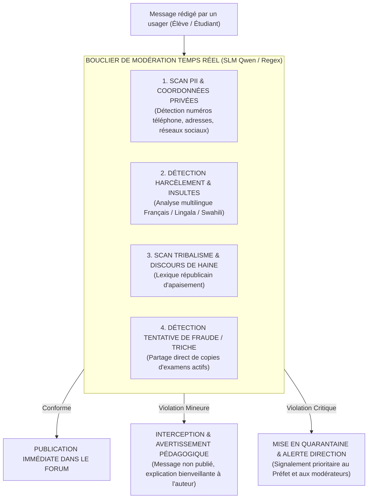

# TOME 8 — CADRE SOUVERAIN, ÉTHIQUE ET INGÉNIERIE DE L'IA
## 141. Modération Automatique des Espaces Communautaires et Protection des Mineurs

---

> **Positionnement :** Moteur NLP de modération sémantique en temps réel, détection des discours haineux et sanctuarisation des mineurs  
> **Autorité :** Conforme à la Constitution ELLYSIUM (Tome 2, Art. 3 — Protection de l'enfance, Art. 19 — Fraternité républicaine)  
> **Liaison amont :** Module 70 (Communications), Module 95 (Vie communautaire) | **Liaison aval :** Module 142 (Plagiat), Module 143 (Sécurité)

---

## 1. Objet et Portée du Sous-Tome

Les espaces numériques réunissant des enfants et des adolescents sont exposés à des menaces graves : cyberharcèlement entre pairs, prédateurs adultes, dérapages tribaux ou propagation de faux corrigés d'examens. Laisser ces espaces sans surveillance permanente ou s'en remettre à une modération humaine a posteriori expose les élèves à des préjudices psychologiques irréversibles. Ce sous-tome spécifie l'architecture du **moteur de modération sémantique en temps réel (Gatekeeper IA)**.

---

## 2. Le Pipeline de Modération Sémantique en Temps Réel (< 50 ms)

Tout message déposé sur un forum, salon de classe ou espace d'entraide traverse le filtre de modération **avant** d'être rendu visible aux autres participants :

---

## 3. Prise en Compte des Langues Nationales et Argot Urbain

**Règle ÉTHIQUE-141-01** : Les insultes ou propos haineux en milieu scolaire en RDC ne s'expriment pas uniquement en français classique. Le classifieur de modération intègre un corpus lexical spécifique entraîné sur :
- Les 4 langues nationales (Lingala, Swahili, Tshiluba, Kikongo).
- L'argot urbain des jeunes (argot kinois, expressions de rue des grandes villes).
- Les expressions subtiles à connotation tribale ou discriminatoire visant des communautés spécifiques.

---

## 4. Masquage Automatique des Coordonnées Privées des Mineurs

Pour empêcher qu'un élève mineur ne communique publiquement son numéro de téléphone personnel ou son profil WhatsApp à des tiers inconnus sur les forums publics :
- Tout format numérique correspondant à un numéro de téléphone mobile (+243...) ou identifiant de réseau social est automatiquement caviardé en temps réel :  
  `[Message masqué : Pour votre sécurité, le partage de coordonnées téléphoniques privées est interdit sur cet espace public]`.

---

## 5. Escalade vers les Modérateurs Humains

Lorsqu'un message est bloqué pour motif critique (menace physique, incitation à la haine, harcèlement caractérisé) :
1. Le message est consigné dans le registre des incidents avec son contexte complet.
2. Une notification prioritaire est transmise au Préfet de l'école et à l'équipe de modération humaine centrale.
3. Le compte de l'auteur peut être suspendu à titre conservatoire pour une durée maximale de **24 heures** dans l'attente de l'audition disciplinaire.

---

## 6. Verrous Techniques de Modération

| Réf. | Intitulé | Conséquence en cas de transgression |
|---|---|---|
| **VF-141-01** | Priorité absolue à la sécurité | En cas de doute sémantique d'un message suspect impliquant la sécurité d'un mineur, le système opte obligatoirement pour la mise en quarantaine conservatoire dans l'attente de la revue humaine. |
| **VF-141-02** | Droit à l'explication | Tout élève dont le message est refusé par la modération automatique reçoit une notification expliquant précisément la règle de la communauté transgressée. |

---

*Sous-tome rédigé conformément aux Normes documentaires ELLYSIUM — Fondations 04.*  
*Version 1.0 — Référence : ELLYSIUM/T8/141/v1.0*

---

## 7. Verrous Fonctionnels Critiques

| Réf. Verrou | Description Fonctionnelle et Technique | Conséquence en Cas de Violation |
| :--- | :--- | :--- |
| **`VF-141-03`** | **Calcul instantané du rang de l'élève après délibération** | Classement intra-classe et inter-classes accessible uniquement aux enseignants. |
| **`VF-141-04`** | **Détection des cas d'ex-aequo avec règle de départage documentée** | Règle de priorité (cotes des matières éliminatoires) appliquée de façon transparente. |
| **`VF-141-05`** | **Export des résultats vers le système EPST en format XML standardisé** | Interface d'export vers les systèmes ministériels de collecte des données scolaires. |
| **`VF-141-06`** | **Toute suggestion d'IA doit inclure un code de confiance (0-100) horodaté et vérifiable** | **Conséquence : violation = inéligibilité du module pour mise en production** |

---

*Sous-tome rédigé conformément aux Normes documentaires ELLYSIUM — Fondations 04.*
