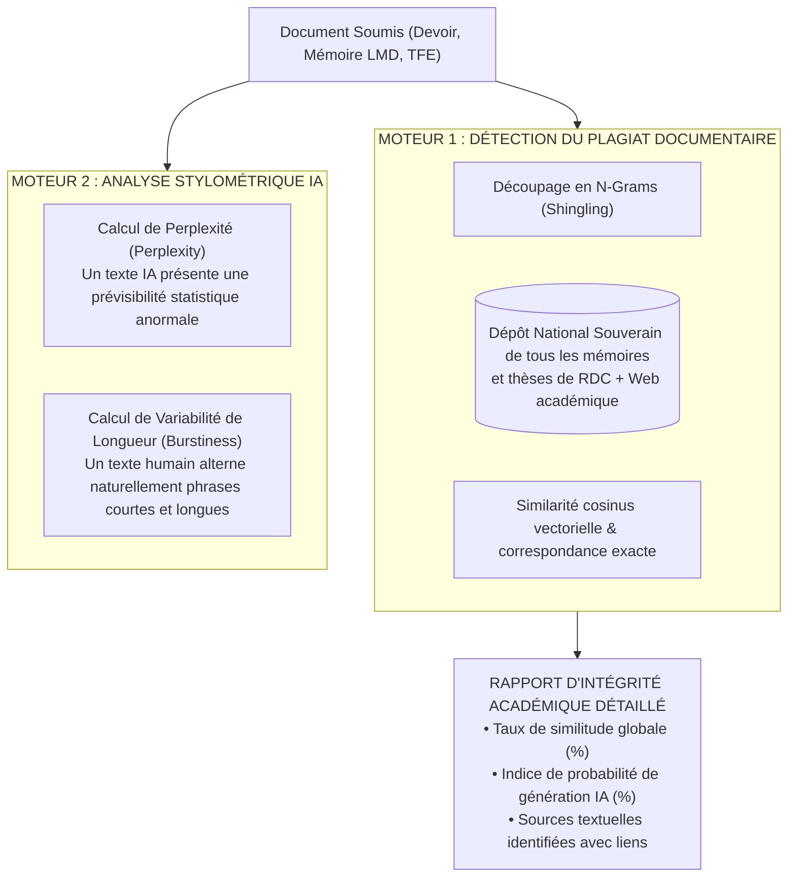

# TOME 8 — CADRE SOUVERAIN, ÉTHIQUE ET INGÉNIERIE DE L'IA
## 142. Détection du Plagiat et Analyse de Contenus Générés par IA

---

> **Positionnement :** Intégrité académique, analyse stylométrique, détection des emprunts textuels et analyse de perplexité  
> **Autorité :** Conforme aux normes de probité scientifique de l'ESU et aux directives anti-fraude aux examens d'État  
> **Liaison amont :** Module 69 (Devoirs), Module 89 (Cursus LMD / Mémoires) | **Liaison aval :** Module 143 (Sécurité)

---

## 1. Objet et Portée du Sous-Tome

La démocratisation des outils d'IA générative et le copier-coller sur Internet menacent directement la valeur des diplômes universitaires et des examens nationaux. Si des mémoires de licence ou des dissertations d'élèves sont intégralement rédigés par des machines ou pillés sur d'anciens travaux sans que cela ne soit détecté, le système tout entier perd sa crédibilité internationale. Ce sous-tome formalise le **Double Moteur Anti-Fraude** d'ELLYSIUM : détection du plagiat littéral et analyse stylométrique des textes générés par IA.

---

## 2. Le Double Moteur d'Analyse d'Intégrité Académique

---

## 3. Seuils d'Admissibilité Métrologiques pour Mémoires LMD

Pour les Travaux de Fin d'Études (TFE) et mémoires de Licence/Master :

| Indicateur Mesuré | Seuil Toléré | Décision Automatique |
|---|---|---|
| **Taux de Similitude Documentaire** | **$\le 15 \%$** | **Conforme** (citations correctement référencées acceptées) |
| **Taux de Similitude Documentaire** | **$16 \% - 25 \%$** | **Avertissement** : Révision obligatoire exigée avant soutenance |
| **Taux de Similitude Documentaire** | **$> 25 \%$** | **Rejet automatique du dépôt** pour soupçon de plagiat caractérisé |
| **Probabilité de Génération par IA** | **$> 75 \%$** | **Convocation obligatoire** de l'étudiant pour épreuve orale de vérification |

---

## 4. Rapport d'Intégrité Transparent pour le Jury

**Règle ÉVAL-142-01** : Le rapport de détection ne se contente pas d'un pourcentage brut :
- Il restitue le document intégral avec un code couleur précis :
  - *Rouge* : Copier-coller textuel exact identifié dans un mémoire antérieur.
  - *Orange* : Paraphrase vectorielle étroite sans citation de l'auteur original.
  - *Violet* : Paragraphe présentant une perplexité anormalement basse caractéristique d'un modèle de langage.
- Le jury de soutenance dispose du rapport complet pour interroger le candidat sur la genèse de son texte.

---

## 5. Dépôt National Souverain des Travaux Universitaires

Chaque mémoire soutenu avec succès en RDC sur ELLYSIUM est automatiquement haché en SHA-256 et indexé dans le **Dépôt National Numérique des Thèses**. Tout futur travail soumis dans n'importe quelle université du pays est immédiatement comparé à cette base, interdisant le recyclage frauduleux de mémoires d'une province à l'autre.

---

## 6. Verrous Techniques Anti-Fraude

| Réf. | Intitulé | Conséquence en cas de transgression |
|---|---|---|
| **VF-142-01** | Rapport d'intégrité joint au dossier de soutenance | Aucun président de jury ne peut autoriser une soutenance de mémoire sans que le rapport d'intégrité certifié ne soit annexé au procès-verbal. |
| **VF-142-02** | Droit d'audition contradictoire | L'accusation de plagiat formulée par le logiciel ne vaut pas condamnation automatique : l'étudiant conserve le droit absolu de défendre la paternité de son travail devant la commission académique. |

---

*Sous-tome rédigé conformément aux Normes documentaires ELLYSIUM — Fondations 04.*  
*Version 1.0 — Référence : ELLYSIUM/T8/142/v1.0*

---

## 7. Verrous Fonctionnels Critiques

| Réf. Verrou | Description Fonctionnelle et Technique | Conséquence en Cas de Violation |
| :--- | :--- | :--- |
| **`VF-142-03`** | **Génération simultanée des bulletins de toute une classe en un clic** | Traitement par lot avec notification de fin de génération au préfet. |
| **`VF-142-04`** | **Vérification préalable de la complétude des données avant génération** | Alerte bloquante si des cotes manquantes sont détectées dans le bulletin. |
| **`VF-142-05`** | **QR Code dynamique liant le bulletin au registre d'authenticité public** | Vérification en ligne de l'authenticité accessible par tout tiers sans inscription. |
| **`VF-142-06`** | **Toute suggestion d'IA doit inclure un code de confiance (0-100) horodaté et vérifiable** | **Conséquence : violation = inéligibilité du module pour mise en production** |

---

*Sous-tome rédigé conformément aux Normes documentaires ELLYSIUM — Fondations 04.*
