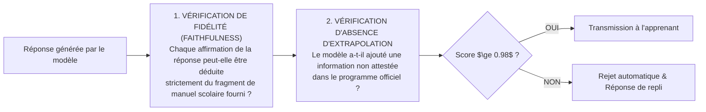

# TOME 8 — CADRE SOUVERAIN, ÉTHIQUE ET INGÉNIERIE DE L'IA
## 144. Protection contre les Biais Culturels et les Hallucinations Fautives

---

> **Positionnement :** Métrologie de la factualité, décolonisation des corpus d'apprentissage et protocoles de double vérification  
> **Autorité :** Conforme aux principes de vérité scientifique, de neutralité républicaine et d'ancrage africain  
> **Liaison amont :** Module 133 (RAG), Module 143 (Sécurité) | **Liaison aval :** Module 145 (Explicabilité), Module 147 (Fine-tuning)

---

## 1. Objet et Portée du Sous-Tome

Les modèles de langage pré-entraînés sur le Web mondial véhiculent deux défaillances critiques pour l'éducation nationale : des **hallucinations factuelles** (inventions de théorèmes, fausses dates historiques, erreurs de calcul) et des **biais culturels occidentalo-centrés** (problèmes scolaires parlant de chutes de neige ou de métros parisiens, incompréhensibles pour un enfant du Kasaï ou de l'Équateur). Ce sous-tome formalise le protocole métrologique d'éradication des hallucinations et d'ancrage culturel authentique.

---

## 2. Métrologie de la Factualité (Seuil de Fidélité $\ge 98\%$)

Pour qu'un modèle soit autorisé à répondre aux élèves d'ELLYSIUM, il est soumis en continu au banc de test d'évaluation automatisé **RAGAS (Retrieval Augmented Generation Assessment)** :

$$\text{Score Global Factualité} = \frac{\text{Fidélité au Contexte} + \text{Pertinence Réponse} + \text{Précision Source}}{3} \ge 0.98$$

---

## 3. Éradication des Biais Culturels et Ancrage Congolais

**Règle ÉTHIQUE-144-01** : Tout exemple ou problème illustratif généré par l'IA doit respecter la réalité matérielle, environnementale et sociale des apprenants congolais :

| Biais Détecté dans les LLM Génériques | Correction Normative Obligatoire ELLYSIUM |
|---|---|
| Exemples basés sur les 4 saisons occidentales (Hiver, Neige) | **Deux saisons tropicales réelles** : Saison des pluies et Saison sèche |
| Exemples de transports urbains inadaptés (Métro, TGV) | Réalités locales : Bateaux fluviaux sur le fleuve Congo, trains SNCC, mototaxis |
| Exemples culinaires ou agricoles allogènes | Produits vivriers locaux : Manioc, maïs, plantain, safou, arachides, poisson du fleuve |
| Unités monétaires étrangères (Euros, Livres) | **Francs Congolais (CDF)** et **Dollars américains (USD)** |
| Patronymes par défaut stéréotypés | Patronymes authentiques des provinces congolaises (Kasongo, Masika, Lukusa, etc.) |

---

## 4. Protocole de Chaîne de Vérification (Verification Chain)

Avant d'émettre une réponse complexe en sciences (Physique, Chimie, Mathématiques) :
1. Le modèle génère d'abord son raisonnement brouillon en interne.
2. Un module vérificateur spécialisé (modèle symbolique de calcul) re-calcule les étapes numériques pour s'assurer qu'aucune erreur d'arithmétique élémentaire ne s'est glissée dans le texte.
3. Si une contradiction est relevée entre le texte et le calcul, le brouillon est invalidé et régénéré.

---

## 5. Verrous Techniques Anti-Hallucination

| Réf. | Intitulé | Conséquence en cas de transgression |
|---|---|---|
| **VF-144-01** | Température d'échantillonnage minimale | Le tuteur IA fonctionne avec une température d'échantillonnage stochastique bridée ($\text{Temperature} \le 0.15$) pour privilégier la rigueur déterministe sur la créativité spéculative. |
| **VF-144-02** | Sanction de l'invention de sources | Toute réponse inventant une fausse référence de page ou un auteur imaginaire entraîne le déclassement immédiat de la version du prompt en production. |

---

*Sous-tome rédigé conformément aux Normes documentaires ELLYSIUM — Fondations 04.*  
*Version 1.0 — Référence : ELLYSIUM/T8/144/v1.0*

---

## 7. Verrous Fonctionnels Critiques

| Réf. Verrou | Description Fonctionnelle et Technique | Conséquence en Cas de Violation |
| :--- | :--- | :--- |
| **`VF-144-03`** | **Attestation de réussite générée automatiquement sous 5 minutes** | Le document est disponible le jour même de la délibération officielle. |
| **`VF-144-04`** | **Numéro de série national unique sur chaque attestation** | Format standardisé par le Ministère pour garantir l'interopérabilité nationale. |
| **`VF-144-05`** | **Revocation publique possible avec journalisation** | Les attestations annulées sont marquées invalides dans le registre public d'authenticité. |
| **`VF-144-06`** | **Toute suggestion d'IA doit inclure un code de confiance (0-100) horodaté et vérifiable** | **Conséquence : violation = inéligibilité du module pour mise en production** |

---

*Sous-tome rédigé conformément aux Normes documentaires ELLYSIUM — Fondations 04.*
