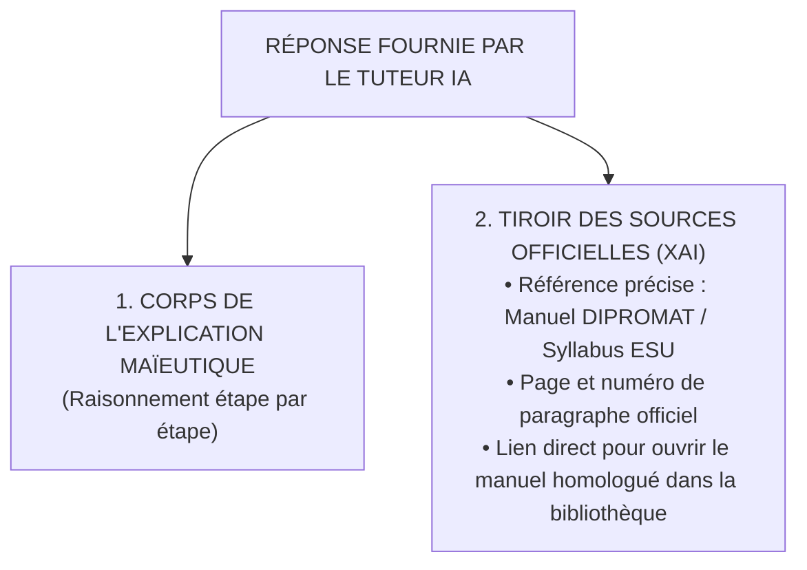

# TOME 8 — CADRE SOUVERAIN, ÉTHIQUE ET INGÉNIERIE DE L'IA
## 145. Transparence envers l'Usager et Explicabilité Algorithmique (XAI)

---

> **Positionnement :** Droit fondamental à l'explicabilité, citation vérifiable des sources et traçabilité du raisonnement  
> **Autorité :** Conforme au droit de recours (Constitution, Art. 8) et aux normes internationales de transparence algorithmique  
> **Liaison amont :** Module 131 (Gouvernance), Module 133 (RAG) | **Liaison aval :** Module 146 (Journal d'audit)

---

## 1. Objet et Portée du Sous-Tome

L'opacité d'une « boîte noire » algorithmique est incompatible avec l'éthique de la transmission du savoir. Un élève ou un enseignant à qui l'on impose une réponse ou une pré-évaluation sans explication rationnelle se trouve dépossédé de son esprit critique. Tout système d'intelligence artificielle intégré à ELLYSIUM doit être **totalement explicable, démontrable et traçable jusqu'aux sources écrites officielles qui le fondent**.

---

## 2. Le Principe de la Citation Obligatoire à la Source



**Règle XAI-145-01** : Aucune affirmation de cours du tuteur IA ne peut être présentée sans être reliée à un fragment officiel consultable d'un clic par l'élève.

---

## 3. Le Panneau d'Inspection Pédagogique pour Enseignants

Pour les enseignants et directeurs d'études, l'interface offre un mode **« Transparence Totale »** permettant de disséquer n'importe quelle suggestion de l'IA :

```
+------------------------------------------------------------------------+
| INSPECTION DE L'INFÉRENCE IA — Devoir #DEV-4SC-0814                    |
+------------------------------------------------------------------------+
| • Modèle exécuté        : Mistral-NeMo-12B-Instruct (vLLM Cluster Kin) |
| • Température           : 0.12 (Déterministe strict)                   |
| • Fragments RAG retenus : 3 chunks (DIPROMAT_CHIMIE_4E_P84.pdf)        |
| • Score de factualité   : 0.992 (Conformité absolue)                   |
| • Justification IA      : "L'élève a correctement équilibré l'équation |
|                           d'oxydoréduction mais a omis l'état physique |
|                           du précipité (s)."                           |
+------------------------------------------------------------------------+
```

---

## 4. Dispositif de Rétroaction Utilisateur (Human Feedback)

En bas de chaque échange avec le tuteur :
- Deux boutons d'évaluation ergonomiques discrets :  
  `[👍 Explication claire et utile]` | `[👎 Explication confuse ou inexacte]`
- Si l'usager clique sur le bouton négatif, un mini-formulaire s'ouvre :
  - *« Quelle était la difficulté ? »* (Réponse fausse / Pas dans le programme / Vocabulaire trop difficile / Autre).
- Ces signalements alimentent directement le tableau de bord du Comité d'Éthique Algorithmique (Module 131).

---

## 5. Verrous Techniques d'Explicabilité

| Réf. | Intitulé | Conséquence en cas de transgression |
|---|---|---|
| **VF-145-01** | Interdiction du raisonnement non traçable | Tout modèle refusant de fournir la chaîne de raisonnement ayant conduit à une pré-évaluation est exclu du pipeline de production. |
| **VF-145-02** | Droit à l'information des parents | Sur simple demande dans l'application, un parent d'élève peut consulter l'ensemble des interactions pédagogiques assistées par IA de son enfant mineur. |

---

*Sous-tome rédigé conformément aux Normes documentaires ELLYSIUM — Fondations 04.*  
*Version 1.0 — Référence : ELLYSIUM/T8/145/v1.0*

---

## 7. Verrous Fonctionnels Critiques

| Réf. Verrou | Description Fonctionnelle et Technique | Conséquence en Cas de Violation |
| :--- | :--- | :--- |
| **`VF-145-03`** | **Accès individuel aux copies corrigées après délibération** | L'élève peut consulter sa copie scannée avec les corrections de l'enseignant. |
| **`VF-145-04`** | **Délai légal de contestation affiché sur le relevé** | Rappel explicite des dates limites de recours sur chaque document de résultat. |
| **`VF-145-05`** | **Commission d'appel numérique avec traçabilité** | Dossier d'appel déposé en ligne avec réponse motivée dans les délais légaux. |
| **`VF-145-06`** | **Toute suggestion d'IA doit inclure un code de confiance (0-100) horodaté et vérifiable** | **Conséquence : violation = inéligibilité du module pour mise en production** |

---

*Sous-tome rédigé conformément aux Normes documentaires ELLYSIUM — Fondations 04.*
