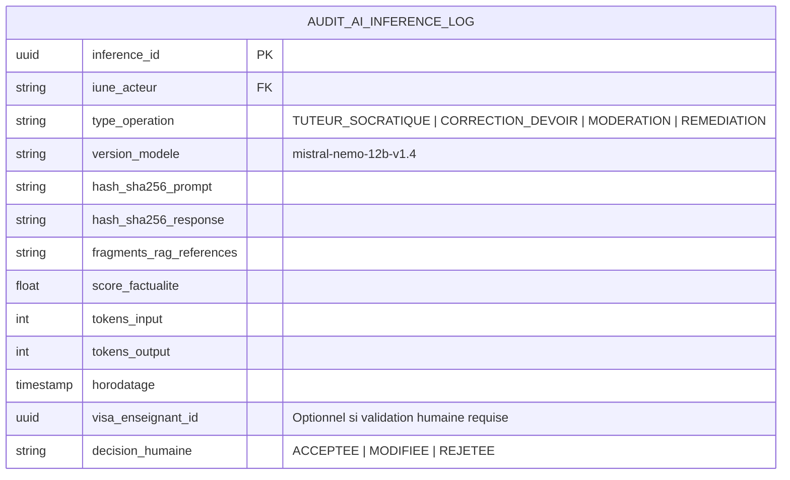

# TOME 8 — CADRE SOUVERAIN, ÉTHIQUE ET INGÉNIERIE DE L'IA
## 146. Journal d'Audit et Traçabilité Immuable des Inférences IA

---

> **Positionnement :** Registre d'audit append-only, traçabilité cryptographique des inférences et opposabilité juridique  
> **Autorité :** Conforme au droit de contrôle de l'Inspection Générale et aux exigences de non-répudiation (Tome 2, Art. 8)  
> **Liaison amont :** Module 108 (Sécurité des données), Module 145 (Explicabilité) | **Liaison aval :** Module 147 (Amélioration continue)

---

## 1. Objet et Portée du Sous-Tome

Dans un cadre éducatif souverain, chaque fois qu'un algorithme assiste la correction d'un travail scolaire, suggère une remédiation ou filtre un propos sur un forum, cet acte doit pouvoir être reconstitué des années plus tard devant une commission d'inspection ou un tribunal administratif. Ce sous-tome formalise l'architecture du **Journal des Inférences et Décisions Assistées par IA**.

---

## 2. Structure Canonique de l'Enregistrement d'Inférence IA

Chaque appel au moteur d'IA génère un enregistrement inaltérable dans la table `audit_ai_inference_log` :

---

## 3. Scellement Cryptographique et Immutabilité

**Règle AUDIT-146-01** : Les entrées du journal d'inférence sont chaînées de manière séquentielle dans un registre cryptographique (*Cryptographic Audit Trail*) :
$$\text{BlocHash}_k = \text{SHA-256}(\text{InferenceID}_k + \text{Horodatage}_k + \text{HashResponse}_k + \text{BlocHash}_{k-1})$$

Aucun administrateur de base de données ne peut modifier ou supprimer une inférence passée sans rompre l'intégrité de la chaîne.

---

## 4. Politique de Rétention et Accès Réglementaire

| Type d'Opération IA | Durée de Conservation Légale | Accès Autorisé |
|---|---|---|
| **Corrections assistées de devoirs** | **5 ans** après la fin de l'année scolaire | Enseignant titulaire, Préfet, Inspecteur IGEN |
| **Pré-analyses de mémoires universitaires (LMD)** | **10 ans** | Jury de mémoire, Doyen, Ministère de l'ESU |
| **Interventions de modération des mineurs** | **3 ans** | Modérateur d'État, Délégué à la protection des mineurs |
| **Dialogues ordinaires du tuteur socratique** | **90 jours** (anonymisé ensuite) | Élève lui-même, parents (si mineur) |

---

## 5. Verrous Techniques d'Auditabilité

| Réf. | Intitulé | Conséquence en cas de transgression |
|---|---|---|
| **VF-146-01** | Interdiction d'inférence non journalisée | Toute requête vers un modèle de langage qui n'émet pas son événement d'audit dans la file persistante est avortée immédiatement par le reverse-proxy d'entrée. |
| **VF-146-02** | Traçabilité des modifications apportées par l'enseignant | Lorsque l'enseignant modifie la note ou l'appréciation suggérée par l'IA, la valeur initiale suggérée et la valeur finale corrigée par l'humain sont toutes deux conservées pour l'histoire. |

---

*Sous-tome rédigé conformément aux Normes documentaires ELLYSIUM — Fondations 04.*  
*Version 1.0 — Référence : ELLYSIUM/T8/146/v1.0*

---

## 7. Verrous Fonctionnels Critiques

| Réf. Verrou | Description Fonctionnelle et Technique | Conséquence en Cas de Violation |
| :--- | :--- | :--- |
| **`VF-146-03`** | **Archivage à 100 ans des diplômes avec redondance géographique** | Deux copies dans deux régions GCP différentes avec politique de rétention illimitée. |
| **`VF-146-04`** | **Lien de vérification permanente accessible par les employeurs** | URL pérenne et non modifiable permettant la vérification à vie d'un diplôme. |
| **`VF-146-05`** | **Emission de transcriptions académiques officielles** | Relevé de notes certifié généré à la demande de l'étudiant avec QR Code. |
| **`VF-146-06`** | **Toute suggestion d'IA doit inclure un code de confiance (0-100) horodaté et vérifiable** | **Conséquence : violation = inéligibilité du module pour mise en production** |

---

*Sous-tome rédigé conformément aux Normes documentaires ELLYSIUM — Fondations 04.*
