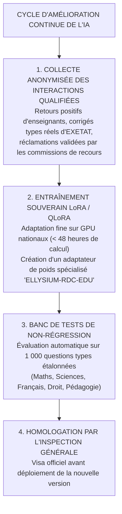

# TOME 8 — CADRE SOUVERAIN, ÉTHIQUE ET INGÉNIERIE DE L'IA
## 147. Amélioration Continue, Fine-Tuning Souverain (LoRA/DPO) et Réévaluation

---

> **Positionnement :** Cycle d'apprentissage continu des modèles, réentraînement supervisé et protocoles de non-régression  
> **Autorité :** Conforme aux normes d'assurance qualité pédagogique (Tome 3, Module 3.9 — Plan PAC)  
> **Liaison amont :** Module 132 (Modèles), Module 146 (Audit) | **Liaison aval :** Module 148 (Optimisation des coûts)

---

## 1. Objet et Portée du Sous-Tome

Un modèle d'IA généraliste ne comprend pas spontanément les spécificités du programme éducatif congolais : la formulation exacte des épreuves d'État, les barèmes des inspecteurs ou la richesse du vocabulaire didactique local. Pour progresser sans réinjecter des milliards de paramètres à l'aveugle, ELLYSIUM déploie une ingénierie d'adaptation souveraine basée sur le **Fine-Tuning frugal (LoRA / QLoRA)** et l'**Alignement Direct par Préférences (DPO)** supervisé par les enseignants.

---

## 2. Le Cycle Annuel de Réévaluation Pédagogique

---

## 3. Méthode d'Adaptation Frugale (LoRA et QLoRA)

**Règle TECH-147-01** : Pour maîtriser les coûts de calcul et préserver la frugalité énergétique :
- Le modèle de base (Mistral NeMo ou Llama 3.1) reste **figé (Frozen Weights)**.
- Seules des matrices de bas rang (**Low-Rank Adapters - LoRA**, rang $r = 16$, alpha $\alpha = 32$) sont entraînées sur les couches d'attention (`q_proj`, `v_proj`).
- Le poids de l'adaptateur final ne dépasse pas **85 Mo**, permettant un déploiement instantané sur tous les serveurs régionaux sans ré-téléchargement du modèle de 15 Go.

---

## 4. Alignement par Préférences Directes (Direct Preference Optimization - DPO)

Pour éradiquer les réponses arrogantes, trop verbeuses ou fournissant des corrigés directs :
- Des paires de réponses sont soumises à un panel d'enseignants titulaires :
  - Réponse A (Maïeutique, bienveillante, rigoureuse) : *Choix Préféré*.
  - Réponse B (Donne la solution directe sans explication) : *Choix Rejeté*.
- L'algorithme DPO ajuste mathématiquement les probabilités du modèle pour favoriser la méthode socratique.

---

## 5. Verrous Techniques de Réévaluation

| Réf. | Intitulé | Conséquence en cas de transgression |
|---|---|---|
| **VF-147-01** | Test de non-régression éliminatoire | Si une nouvelle version du modèle LoRA obtient un score inférieur à la version précédente sur le banc de mathématiques ou de grammaire, son déploiement est immédiatement bloqué. |
| **VF-147-02** | Sanctuarisation des données d'entraînement | Aucun devoir d'élève n'est utilisé pour le fine-tuning sans anonymisation cryptographique irréversible et sans l'accord des commissions d'éthique. |

---

*Sous-tome rédigé conformément aux Normes documentaires ELLYSIUM — Fondations 04.*  
*Version 1.0 — Référence : ELLYSIUM/T8/147/v1.0*

---

## 7. Verrous Fonctionnels Critiques

| Réf. Verrou | Description Fonctionnelle et Technique | Conséquence en Cas de Violation |
| :--- | :--- | :--- |
| **`VF-147-03`** | **Simulation d'examen blanc avec feedback immédiat** | L'apprenant peut s'entraîner sur des épreuves types avec correction automatique. |
| **`VF-147-04`** | **Statistiques de performance individuelle sur les examens blancs** | Courbes d'évolution personnalisées par matière et par type d'épreuve. |
| **`VF-147-05`** | **Recommandation IA de révision ciblée (purement consultative)** | Le tuteur IA suggère les chapitres à réviser en priorité sans décider de la note finale. |
| **`VF-147-06`** | **Toute suggestion d'IA doit inclure un code de confiance (0-100) horodaté et vérifiable** | **Conséquence : violation = inéligibilité du module pour mise en production** |

---

*Sous-tome rédigé conformément aux Normes documentaires ELLYSIUM — Fondations 04.*
