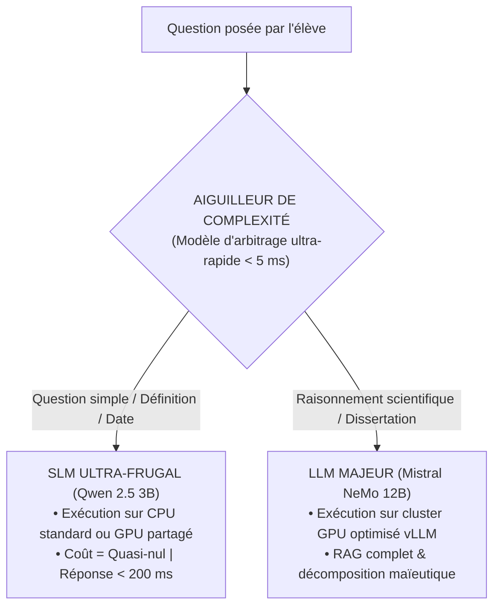
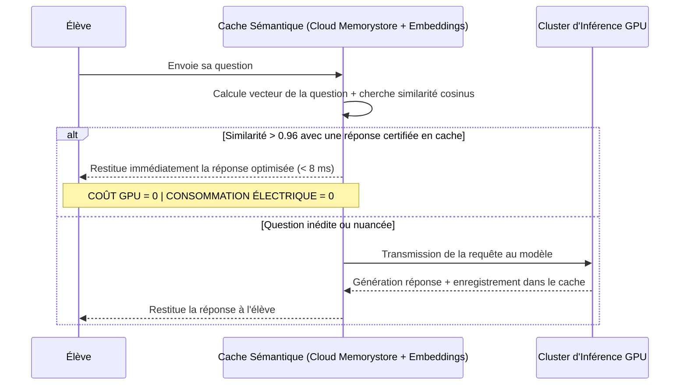

# TOME 8 — CADRE SOUVERAIN, ÉTHIQUE ET INGÉNIERIE DE L'IA
## 148. Optimisation des Coûts d'Inférence, Frugalité Énergétique et Cache Sémantique

---

> **Positionnement :** Ingénierie économique de l'IA, mise en cache sémantique des requêtes et routage en cascade de modèles  
> **Autorité :** Condition impérative de pérennité de la gratuité constitutionnelle des apprenants indépendants (Tome 2, Art. 4)  
> **Liaison amont :** Module 107 (Coût maîtrisé), Module 132 (Modèles) | **Liaison aval :** Module 149 (Matrice de dépendances)

---

## 1. Objet et Portée du Sous-Tome

L'utilisation inconsidérée de modèles d'IA générative peut rapidement engendrer des factures énergétiques et matérielles astronomiques. Pour que l'instruction nationale d'ELLYSIUM demeure gratuite pour des millions d'enfants congolais, chaque milliseconde de calcul GPU doit être optimisée. Ce sous-tome formalise la stratégie de **Frugalité Inférentielle Maximale**, permettant de maintenir le coût d'une interaction d'élève en dessous du seuil cible de **0,00008 USD**.

---

## 2. L'Architecture de Routage en Cascade (Model Cascade Routing)

Toutes les questions des élèves ne nécessitent pas la puissance d'un grand modèle de 12 milliards de paramètres. ELLYSIUM déploie un **Aiguilleur de Complexité Sémantique** :

---

## 3. Cache Sémantique des Questions Fréquentes (Semantic Caching)

Dans un programme scolaire national, des milliers d'élèves de 4e secondaire posent chaque année exactement les mêmes questions conceptuelles (ex. *« Comment calculer la limite quand x tend vers l'infini ? »* ou *« Quelle est la différence entre mitose et méiose ? »*).

**Règle TECH-148-01** : Le cache sémantique permet d'absorber **jusqu'à 60 % du trafic global du tuteur** sans solliciter le moindre calcul GPU lourd.

---

## 4. Batching Dynamique Continu (Continuous Batching)

Sur les serveurs GPU centraux, le moteur *vLLM* regroupe dynamiquement les requêtes des élèves arrivant dans un intervalle de quelques millisecondes :
- Au lieu de traiter 1 requête par passe, le serveur agrège jusqu'à **64 requêtes simultanées** dans la même passe de calcul matriciel.
- Le rendement énergétique par token généré est multiplié par un facteur de **4.8**.

---

## 5. Mode Veille et Éco-Conception Nocturne

Entre **00h30 et 05h30** (heures creuses où le trafic scolaire chute de plus de $95\%$) :
- 80 % des nœuds de calcul GPU basculent automatiquement en veille prolongée (*Scale-to-Zero* pour les pods secondaires).
- Seule une instance de secours minimale reste active pour les étudiants de nuit de la diaspora.

---

## 6. Verrous Techniques de Frugalité

| Réf. | Intitulé | Conséquence en cas de transgression |
|---|---|---|
| **VF-148-01** | Plafond de tokens par réponse | Le tuteur IA est configuré avec une limite maximale de sortie de **350 tokens par réponse** pour favoriser les explications concises et prévenir le bavardage verbeux inutile. |
| **VF-148-02** | Alerte de surconsommation budgétaire | Tout pic anormal d'inférence non corrélé au calendrier scolaire (détection d'attaque par déni de service de requêtes IA) déclenche le bridage immédiat des quotas. |

---

*Sous-tome rédigé conformément aux Normes documentaires ELLYSIUM — Fondations 04.*  
*Version 1.0 — Référence : ELLYSIUM/T8/148/v1.0*

---

## 7. Verrous Fonctionnels Critiques

| Réf. Verrou | Description Fonctionnelle et Technique | Conséquence en Cas de Violation |
| :--- | :--- | :--- |
| **`VF-148-03`** | **Tableau de bord de suivi de la cohorte par le directeur** | Statistiques de réussite, d'échec et d'abandon par niveau et filière. |
| **`VF-148-04`** | **Alertes précoces de risque de décrochage académique** | Signal automatique si l'assiduité combinée aux résultats prédit un échec probable. |
| **`VF-148-05`** | **Rapport annuel de performance académique pour l'EPST** | Synthèse statistique exportable pour la collecte nationale des données éducatives. |
| **`VF-148-06`** | **Toute suggestion d'IA doit inclure un code de confiance (0-100) horodaté et vérifiable** | **Conséquence : violation = inéligibilité du module pour mise en production** |

---

*Sous-tome rédigé conformément aux Normes documentaires ELLYSIUM — Fondations 04.*
