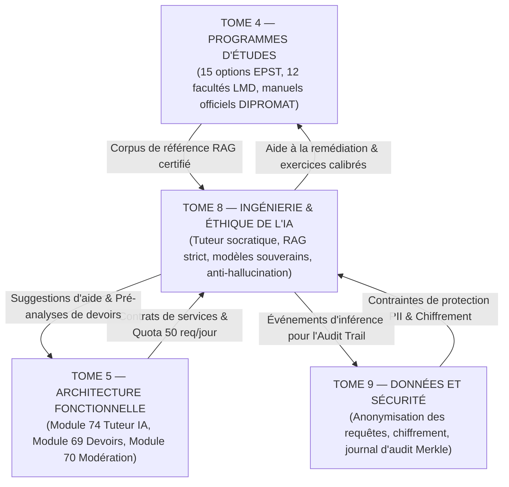

# TOME 8 — CADRE SOUVERAIN, ÉTHIQUE ET INGÉNIERIE DE L'IA
## 149. Matrice des Dépendances Formelle — Liaisons avec les Tomes 4, 5 et 9

---

> **Positionnement :** Cartographie des dépendances contractuelles de l'IA avec les programmes pédagogiques, la fonction et la sécurité  
> **Autorité :** Conforme aux conventions de traçabilité intégrale ELLYSIUM (Fondations 04)  
> **Liaison amont :** Tome 4 (Programmes), Tome 5 (Architecture Fonctionnelle) | **Liaison aval :** Tome 9 (Données et Sécurité), Tome 10 (Gouvernance)

---

## 1. Objet et Portée du Sous-Tome

L'Intelligence Artificielle d'ELLYSIUM ne possède aucune existence autonome hors des règles pédagogiques et juridiques de l'institution. Elle se nourrit des programmes d'études nationaux du Tome 4, sert les cas d'usage fonctionnels du Tome 5, et applique les verrous de sécurité et de confidentialité du Tome 9. Ce sous-tome formalise la matrice des dépendances croisées clôturant le cycle d'ingénierie du Tome 8.

---

## 2. Diagramme d'Interdépendance du Moteur d'IA

---

## 3. Matrice de Traçabilité Croisée Inter-Tomes

| Module Tome 8 (IA) | Dépendance Programmes (Tome 4) | Dépendance Métier (Tome 5) | Dépendance Sécurité (Tome 9) | Contrat d'Interface & Invariants Assurés |
|---|---|---|---|---|
| **130. Périmètre & Constitution** | Tous curricula | Mod. 56 (Constitution) | Mod. 151 (Conformité) | Interdiction absolue de notation ou délibération automatique par l'IA. |
| **133. Architecture RAG** | Modules 4.1 à 4.54 | Mod. 73 (Bibliothèque) | Mod. 155 (Isolation DB) | Ancrage sur 100% des manuels officiels, seuil de pertinence $> 0.72$ obligatoire. |
| **134. Le Tuteur IA** | Tous programmes | Mod. 74 (Tuteur fonctionnel)| Mod. 156 (Authentification) | Quota strict de 50 requêtes/jour, refus courtois mais ferme des corrigés directs. |
| **136. Génération d'exercices** | Modules 4.9-23 & 4.24-54 | Mod. 69 (Devoirs) | Mod. 158 (Contrôle d'accès)| QCM conformes aux maquettes EXETAT à 5 options, validation humaine requise. |
| **137. Correction assistée** | Tous référentiels | Mod. 66 (Cahier cotes) | Mod. 160 (Signature) | Pré-grille critériée indicative, signature cryptographique obligatoire du professeur. |
| **138. Détection décrochage** | N/A | Mod. 65 (Présences) | Mod. 162 (Confidentialité) | Score IVS confidentiel d'écoute sociale, interdiction formelle d'exclusion prédictive. |
| **141. Modération espaces** | N/A | Mod. 70 (Messagerie) | Mod. 164 (Protection mineurs)| Filtrage temps réel < 50 ms des insultes, propos tribaux et coordonnées privées. |
| **142. Détection du plagiat** | Dépôt thèses national | Mod. 75 (Examens) | Mod. 166 (Non-répudiation) | Rapport de similitude officiel exigé pour toute soutenance de mémoire LMD. |
| **143. Sécurité & Guardrails**| N/A | Mod. 80 (RBAC) | Mod. 168 (Défense WAF) | Neutralisation des attaques par injection de prompt et isolation du système. |
| **146. Journal d'audit IA** | N/A | Mod. 82 (Sync/Journal) | Mod. 170 (Merkle Tree) | Traçabilité inaltérable de chaque inférence conservée de 5 à 10 ans. |
| **148. Frugalité des coûts** | N/A | Mod. 71 (Caisse) | Mod. 171 (Ressources) | Coût par interaction $< 0.00008$ USD pour préserver la gratuité républicaine. |

---

## 4. Protocole d'Arbitrage Éthique et Algorithmique

En cas de contestation par un apprenant ou un enseignant sur une prédiction ou un comportement de l'IA :
1. **Primauté de l'Humain** : L'enseignant ou le jury académique a toujours le dernier mot, sans justification à apporter vis-à-vis de l'algorithme.
2. **Revue par le CNEAE** : Tout litige récurrent est transmis au Comité National d'Éthique Algorithmique (Module 131) pour ajustement des règles de filtrage.
3. **Audit continu** : Aucune mise à jour de modèle ne peut être déployée sans validation préalable par le collège d'inspection pédagogique.

---

*Sous-tome rédigé conformément aux Normes documentaires ELLYSIUM — Fondations 04.*  
*Version 1.0 — Référence : ELLYSIUM/T8/149/v1.0*
