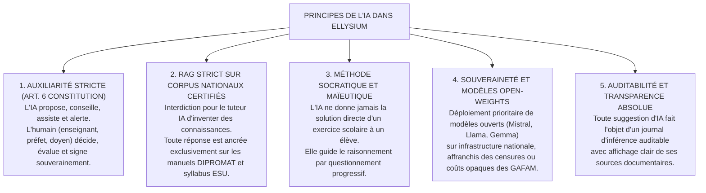

# TOME 8 — CADRE SOUVERAIN, ÉTHIQUE ET INGÉNIERIE DE L'INTELLIGENCE ARTIFICIELLE

---

> **Autorité doctrinale :** Conforme à la Constitution ELLYSIUM (Tome 2, Art. 6 — Auxiliarité de l'IA, interdiction absolue de l'IA décisionnelle finale)  
> **Liaison amont :** Tome 3 (Architecture Pédagogique), Tome 4 (Programmes d'Études), Tome 5 (Module 74 — Tuteur IA)  
> **Liaison aval :** Tome 9 (Sécurité & Données), Tome 10 (Gouvernance), Tome 14 (Conformité Légale)

---

## 1. Vision et Piliers Constitutionnels de l'IA

L'Intelligence Artificielle au sein d'ELLYSIUM est conçue comme un **amplificateur de l'action pédagogique humaine**, jamais comme un substitut à l'autorité du professeur ou du préfet. Dans un monde où les technologies génératives véhiculent des biais culturels massifs et génèrent des hallucinations trompeuses, ELLYSIUM pose une doctrine d'ingénierie stricte : **corpus fermés et certifiés (RAG strict), souveraineté des modèles, explicabilité totale et supervision humaine obligatoire**.

---

## 2. Sommaire des 20 Sous-Tomes d'Ingénierie de l'IA

| Sous-Tome | Intitulé | Objet & Contenu Clé |
|---|---|---|
| [**130**](./130/README.md) | **Périmètre du Tome 8 — Principes Constitutionnels** | Statut d'auxiliaire de l'IA, interdiction de substitution humaine |
| [**131**](./131/README.md) | **Gouvernance Éthique et Supervision Humaine** | Droit de recours de l'élève, comités d'audit algorithmique |
| [**132**](./132/README.md) | **Choix des Modèles (LLM Ouverts vs Spécifiques)** | Comparatif technique (Mistral NeMo, Llama 3, modèles SLM frugaux) |
| [**133**](./133/README.md) | **Architecture RAG pour Contenus Pédagogiques** | Indexation vectorielle (Qdrant / pgvector), chunking sémantique DIPROMAT |
| [**134**](./134/README.md) | **Le Tuteur IA — Fonctionnement et Limites** | Posture socratique, quota de 50 requêtes/jour, refus des corrigés directs |
| [**135**](./135/README.md) | **Personnalisation des Parcours d'Apprentissage** | Algorithmes d'adaptation au rythme de l'apprenant sans profilage intrusif |
| [**136**](./136/README.md) | **Génération et Suggestion d'Exercices** | Génération de variantes d'examens et QCM calibrés sur le programme |
| [**137**](./137/README.md) | **Correction Assistée par IA (Devoirs et Dissertations)** | Pré-analyse de cohérence, détection de contresens, visa professeur obligatoire |
| [**138**](./138/README.md) | **Détection Précoce du Décrochage Scolaire** | Analyse des signaux faibles d'assiduité pour déclencher l'aide sociale |
| [**139**](./139/README.md) | **Recommandations Pédagogiques et Remédiation** | Parcours de consolidation ciblés après un échec périodique |
| [**140**](./140/README.md) | **Assistance Administrative par IA** | Aide à la rédaction des synthèses de bulletins et rapports d'inspection |
| [**141**](./141/README.md) | **Modération Automatique des Espaces Communautaires** | Filtrage sémantique des propos haineux et protection absolue des mineurs |
| [**142**](./142/README.md) | **Prévention du Plagiat et Détection de Textes IA** | Analyse stylométrique et comparaison vectorielle avec la base nationale |
| [**143**](./143/README.md) | **Sécurité des Modèles — Prompt Injection & Jailbreak** | Boucliers de sécurité (NeMo Guardrails), assainissement des prompts |
| [**144**](./144/README.md) | **Protection contre les Biais et Hallucinations** | Métriques de fidélité documentaire (Factuality Score > 98%) |
| [**145**](./145/README.md) | **Transparence et Explicabilité envers l'Usager** | Citation des extraits officiels pour chaque réponse du tuteur |
| [**146**](./146/README.md) | **Journal d'Audit des Décisions Assistées** | Traçabilité inaltérable de chaque inférence et suggestion d'IA |
| [**147**](./147/README.md) | **Amélioration Continue et Fine-Tuning Souverain** | Réentraînement supervisé sur corpus scolaires congolais validés |
| [**148**](./148/README.md) | **Optimisation des Coûts d'Inférence et Frugalité** | Quantification 4-bit (AWQ/GGUF), modèles locaux SLM (Small Language Models) |
| [**149**](./149/README.md) | **Matrice des Dépendances Formelle** | Liaisons contractuelles du Tome 8 avec les Tomes 4, 5 et 9 |

---

*Tome 8 approuvé conformément aux principes directeurs du Plan Général d'Implémentation (PGI).*  
*Référence : ELLYSIUM/T8/README/v1.0*
