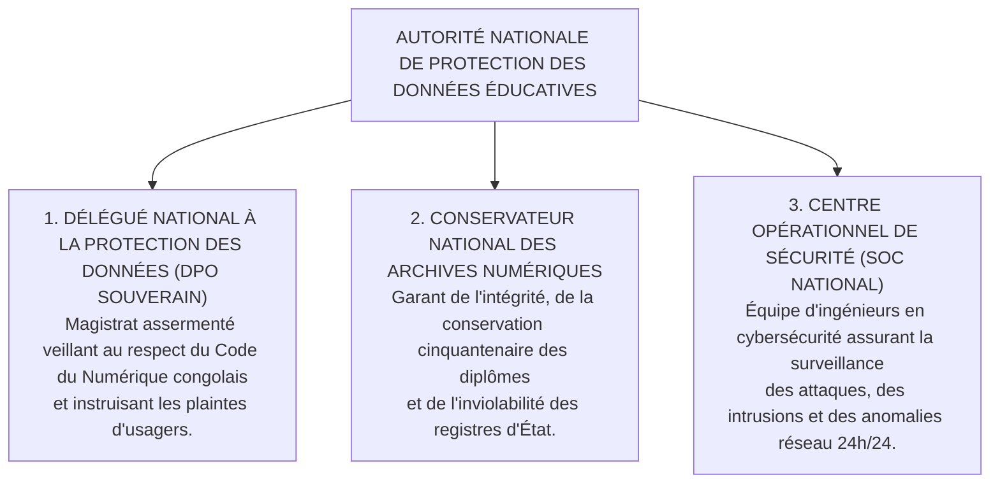

# TOME 9 — GOUVERNANCE DES DONNÉES ET CYBERSÉCURITÉ
## 150. Périmètre du Tome 9 et Principes de Gouvernance des Données Souveraines

---

> **Positionnement :** Cadre institutionnel de gouvernance des données, instances de régulation et politique de sécurité globale  
> **Autorité :** Conforme au Code du Numérique congolais (Ordonnance-Loi n° 23/010) et au Tome 2, Article 1  
> **Liaison amont :** Tome 2 (Constitution), Tome 7 (Architecture Technique) | **Liaison aval :** Modules 151 à 170

---

## 1. Objet et Portée du Sous-Tome

Les bases de données d'ELLYSIUM renferment l'identité civile complète, l'historique intellectuel, les bulletins scolaires, les délibérations universitaires et les transactions financières de plusieurs millions d'enfants et de citoyens de la République Démocratique du Congo. Ce sous-tome fixe les principes directeurs de gouvernance des données souveraines, établit la hiérarchie des responsabilités institutionnelles et définit la doctrine de sanctuarisation de ce patrimoine public national inaliénable.

---

## 2. Les Organes de Gouvernance des Données ELLYSIUM

---

## 3. Principes Directeurs de Gouvernance

1. **Patrimoine Public Inaliénable** : Les données académiques appartiennent à la nation congolaise et aux usagers eux-mêmes. Elles ne peuvent être vendues, hypothéquées, louées ou transférées à aucune entité privée nationale ou étrangère.
2. **Finalité Éducative Exclusive** : Toute donnée collectée sert uniquement et exclusivement à l'instruction, à l'évaluation, à la diplomation et à l'aide à la scolarité. Zéro usage commercial, publicitaire ou de profilage politique.
3. **Sécurité et Confidentialité dès la Conception (Privacy by Design)** : Aucun service ne peut être déployé sans avoir fait l'objet d'une analyse d'impact sur la vie privée (*Privacy Impact Assessment - PIA*) validée par le DPO.

---

## 4. Verrous Fonctionnels de Gouvernance

| Réf. | Intitulé | Conséquence en cas de transgression |
|---|---|---|
| **VF-150-01** | Interdiction de transfert transfrontalier non souverain | L'hébergement de données personnelles identifiantes d'élèves congolais hors des serveurs souverains agréés par l'État est passible de poursuites pénales pour atteinte à la sécurité nationale. |
| **VF-150-02** | Obligation de veto du DPO | Tout traitement de données jugé attentatoire aux droits fondamentaux des élèves par le DPO Souverain est suspendu de plein droit sans recours administratif préalable. |

| **`VF-150-03`** | **Registre des traitements de données conforme à la Loi 15-023** | Inventaire complet de tous les traitements avec finalité, durée et base légale. |
| **`VF-150-04`** | **Nomination formelle du Délégué à la Protection des Données (DPO)** | Le DPO est désigné par le CA et son identité publiée sur ellysium.cd. |
| **`VF-150-05`** | **Procédure de notification de violation dans les 72h** | Tout incident de violation de données est signalé à l'autorité compétente et aux victimes. |
---

*Sous-tome rédigé conformément aux Normes documentaires ELLYSIUM — Fondations 04.*  
*Version 1.0 — Référence : ELLYSIUM/T9/150/v1.0*
