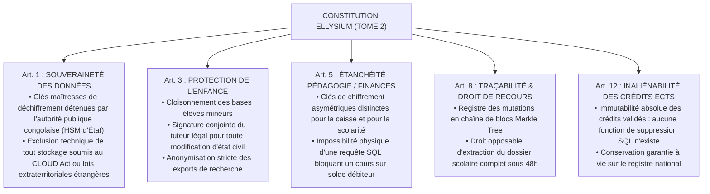

# TOME 9 — GOUVERNANCE DES DONNÉES ET CYBERSÉCURITÉ
## 151. Conformité Constitutionnelle — Traçabilité, Intégrité et Protection des Droits

---

> **Positionnement :** Traduction des articles constitutionnels en contraintes d'intégrité de données et de sécurité cryptographique  
> **Autorité :** Constitution ELLYSIUM (Tome 2, Art. 1, 3, 5, 8, 12) — Norme suprême  
> **Liaison amont :** Tome 2 (Constitution), Module 56 (Conformité fonctionnelle) | **Liaison aval :** Module 152 (MCD), Module 158 (Chiffrement)

---

## 1. Objet et Portée du Sous-Tome

La sécurité des données d'ELLYSIUM n'est pas une simple conformité technique à des normes industrielles abstraites : elle est l'application directe des principes constitutionnels de la République Éducative. Toute défaillance de sécurité qui permettrait d'altérer une note, d'effacer les crédits d'un étudiant ou d'interdire l'accès d'un enfant pauvre pour impayé constituerait un crime constitutionnel. Ce sous-tome formalise le registre des contraintes techniques suprêmes.

---

## 2. Traduction des Articles Constitutionnels en Contraintes Techniques

---

## 3. Registre de Non-Répudiation des Actes Académiques

**Règle CONFORMITÉ-151-01** : Tout acte administratif ou académique d'importance (délivrance de bulletin, inscription d'une cote d'examen d'État, exclusion disciplinaire, attribution de bourse) est scellé par une triple signature cryptographique :
$$\text{Acte Valide} \iff \text{Sign}_{\text{Auteur}}(\text{Document}) \land \text{Sign}_{\text{ChefÉtablissement}}(\text{Document}) \land \text{Horodatage}_{\text{TSA}}(\text{Document})$$

Aucune autorité, pas même le Ministre en exercice, ne peut effacer ou modifier rétroactivement un acte ainsi scellé.

---

## 4. Verrous Constitutionnels de Sécurité

| Réf. | Intitulé | Conséquence en cas de transgression |
|---|---|---|
| **VF-151-01** | Nullité absolue de l'altération sans recours | Toute modification de note intervenue sans respecter la procédure contradictoire de l'Article 8 est automatiquement annulée par le système et rétablit la valeur d'origine. |
| **VF-151-02** | Sanction de la rupture d'étanchéité financière | Tout module logiciel tentant de restreindre le droit d'étudier en fonction d'un retard de paiement déclenche une alerte rouge constitutionnelle et la suspension du compte auteur. |

---

*Sous-tome rédigé conformément aux Normes documentaires ELLYSIUM — Fondations 04.*  
*Version 1.0 — Référence : ELLYSIUM/T9/151/v1.0*

---

## 7. Verrous Fonctionnels Critiques

| Réf. Verrou | Description Fonctionnelle et Technique | Conséquence en Cas de Violation |
| :--- | :--- | :--- |
| **`VF-151-03`** | **Interdiction absolue de profilage commercial des apprenants** | Les données éducatives ne peuvent jamais être cédées à des régies publicitaires. |
| **`VF-151-04`** | **Droit à la portabilité des données académiques** | L'apprenant peut exporter son dossier complet en format JSON/PDF à tout moment. |
| **`VF-151-05`** | **Suppression certifiée via crypto-shredding** | La suppression de données personnelles est réalisée par destruction de clé cryptographique. |
| **`VF-151-06`** | **Aucun accès en ligne de mire aux données sensibles n'est possible sans justifier d'un motif légitime** | **Conséquence : violation = inéligibilité du module pour mise en production** |

---

*Sous-tome rédigé conformément aux Normes documentaires ELLYSIUM — Fondations 04.*
