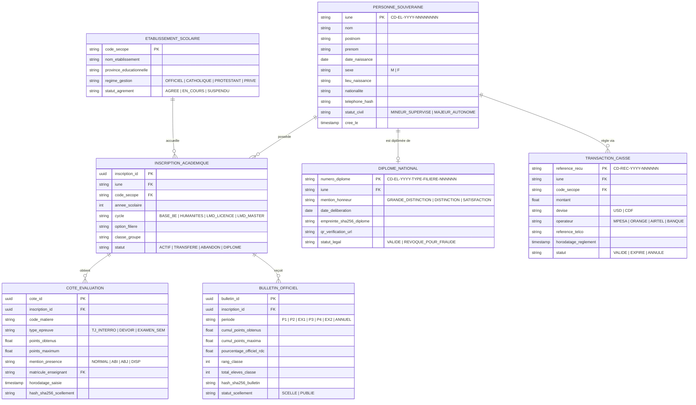

# TOME 9 — GOUVERNANCE DES DONNÉES ET CYBERSÉCURITÉ
## 152. Modèle de Données Conceptuel et Physique Sécurisé (MCD / MPD)

---

> **Positionnement :** Schéma d'ingénierie relationnelle, intégrité référentielle stricte et indexation physique sécurisée  
> **Autorité :** Conforme aux normes d'intégrité relationnelle ACID et au Tome 5, Module 60 (Dossier IUNE)  
> **Liaison amont :** Module 114 (Base PostgreSQL), Module 151 (Conformité) | **Liaison aval :** Module 153 (Cartographie), Module 155 (Historisation)

---

## 1. Objet et Portée du Sous-Tome

Le schéma de base de données d'ELLYSIUM est la colonne vertébrale numérique de l'institution. Une modélisation floue ou des contraintes d'intégrité faibles ouvriraient la porte à des corruptions d'historique ou des doublons d'élèves catastrophiques. Ce sous-tome formalise le **Modèle Conceptuel de Données (MCD)** et le **Modèle Physique de Données (MPD)** sécurisé sous PostgreSQL 16.

---

## 2. Modèle Conceptuel de Données Maître (Diagramme Mermaid)

---

## 3. Règles d'Intégrité Référentielle Absolue (Contraintes SQL)

**Règle TECH-152-01** : Toutes les relations clés sont protégées contre les suppressions en cascade accidentelles :
- Clause `ON DELETE RESTRICT` obligatoire sur les liens `PERSONNE_SOUVERAINE` $\rightarrow$ `INSCRIPTION` $\rightarrow$ `COTE`. Aucune personne ne peut être supprimée de la base si elle a déjà passé une épreuve ou obtenu un relevé.
- Unicité stricte sur l'IUNE (`UNIQUE (iune)`), sur la combinaison `UNIQUE (iune, annee_scolaire, code_secope)` et sur le numéro de diplôme.

---

## 4. Stratégie d'Indexation Physique Haute Vitesse

Pour assurer des temps de réponse inférieurs à 10 ms lors de la consultation des résultats scolaires :
- **Index B-Tree composites** sur `(inscription_id, code_matiere, type_epreuve)`.
- **Index BRIN (Block Range Index)** sur la table chronologique `audit_ai_inference_log`, réduisant la taille des index de $95\%$ sur les séries temporelles de plusieurs dizaines de millions d'enregistrements.
- **Index hash** sur `empreinte_sha256_diplome` pour une vérification publique instantanée en $O(1)$.

---

## 5. Verrous Techniques de Modélisation

| Réf. | Intitulé | Conséquence en cas de transgression |
|---|---|---|
| **VF-152-01** | Interdiction des clés primaires non sécurisées | L'utilisation d'entiers auto-incrémentés (`SERIAL / BIGSERIAL`) comme identifiants publics est formellement bannie pour éviter l'énumération de données. Utilisation exclusive de l'IUNE ou d'UUID v7 ordonnables. |
| **VF-152-02** | Obligation de champs d'audit standardisés | Toute table du système comporte obligatoirement les champs `created_at`, `updated_at`, `created_by` et `deleted_at`. |

---

*Sous-tome rédigé conformément aux Normes documentaires ELLYSIUM — Fondations 04.*  
*Version 1.0 — Référence : ELLYSIUM/T9/152/v1.0*

---

## 7. Verrous Fonctionnels Critiques

| Réf. Verrou | Description Fonctionnelle et Technique | Conséquence en Cas de Violation |
| :--- | :--- | :--- |
| **`VF-152-03`** | **Normalisation des identifiants selon le référentiel national IUNE** | Aucun doublon de dossier académique ne peut exister dans le système. |
| **`VF-152-04`** | **Versionnement des schémas de données avec migration sans interruption** | Toute modification de schéma est déployée sans perte de données ni coupure de service. |
| **`VF-152-05`** | **Validation de l'intégrité référentielle à chaque transaction** | Les contraintes de clé étrangère sont maintenues et auditées en continu. |
| **`VF-152-06`** | **Aucun accès en ligne de mire aux données sensibles n'est possible sans justifier d'un motif légitime** | **Conséquence : violation = inéligibilité du module pour mise en production** |

---

*Sous-tome rédigé conformément aux Normes documentaires ELLYSIUM — Fondations 04.*
