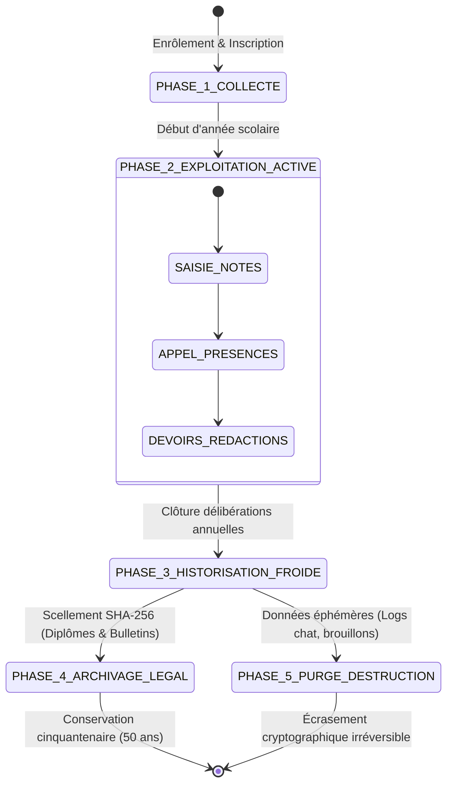

# TOME 9 — GOUVERNANCE DES DONNÉES ET CYBERSÉCURITÉ
## 154. Cycle de Vie de la Donnée — Collecte, Exploitation, Archivage Cinquantenaire et Destruction

---

> **Positionnement :** Gestion temporelle des enregistrements, règles d'archivage d'État et destruction cryptographique sécurisée  
> **Autorité :** Conforme aux normes d'archivage public de la RDC et aux règles de rétention légale (Tome 5, Module 82)  
> **Liaison amont :** Module 153 (Cartographie) | **Liaison aval :** Module 155 (Historisation), Module 168 (Rétention)

---

## 1. Objet et Portée du Sous-Tome

Les données scolaires ne peuvent pas être conservées indéfiniment sans règle ni empilées sans discernement. Un diplôme d'État doit demeurer vérifiable dans un demi-siècle, tandis qu'un brouillon d'exercice ou un enregistrement de tuteur IA doit être purgé rapidement pour protéger la vie privée des élèves. Ce sous-tome formalise le **Cycle de Vie en 5 Phases** de chaque enregistrement informationnel au sein d'ELLYSIUM.

---

## 2. Les 5 Phases du Cycle de Vie Informationnel

---

## 3. Spécifications Temporelles par Type de Données

| Famille de Données | Phase Active (Base Chaude) | Phase Historique (Lecture Seule) | Rétention Finale (Archivage Légal) |
|---|---|---|---|
| **Diplômes d'État & Titres LMD** | Année d'émission | 5 ans | **50 ans minimum** (Inaltérable) |
| **Bulletins Annuels Officiels** | Année scolaire en cours | 10 ans | **50 ans** (Archives nationales) |
| **Cahier des Cotes Journalier** | Période active (trimestre) | Année scolaire | **10 ans** (Contentieux légal) |
| **Reçus de Paiement Caisse** | Exercice budgétaire en cours | 3 ans | **10 ans** (Normes OHADA) |
| **Copies de Devoirs Scannées** | Trimestre en cours | Fin d'année scolaire | **Purge à N+1** (Destruction) |
| **Dialogues avec le Tuteur IA** | 7 jours | 90 jours | **Purge irréversible à J+90** |

---

## 4. Protocole de Destruction Cryptographique Sécurisée (Crypto-Shredding)

**Règle TECH-154-01** : Lorsqu'une donnée arrive au terme légal de sa durée de rétention (ex. dialogues de chat d'un mineur au bout de 90 jours ou copies de devoirs manuscrites après l'année scolaire) :
- Les données chiffrées ne font pas l'objet d'un simple effacement logique (`deleted_at = true`).
- Le système applique le **Crypto-Shredding** : destruction irréversible de la clé de chiffrement spécifique associée au lot de données, rendant mathématiquement impossible tout déchiffrement ultérieur, même en cas de récupération forensique des blocs disques physiques.
- Un certificat de destruction numéroté est émis et versé au registre d'audit de sécurité.

---

## 5. Verrous Techniques du Cycle de Vie

| Réf. | Intitulé | Conséquence en cas de transgression |
|---|---|---|
| **VF-154-01** | Impossibilité de purger les diplômes | Aucune routine de nettoyage ou commande administrative ne peut cibler la table des diplômes scellés (`diplome_national`). La table est protégée par un verrou matériel en base. |
| **VF-154-02** | Exécution automatique des purges temporaires | Le cron de purge nocturne des conversations IA s'exécute obligatoirement chaque nuit à 02h00. Tout échec déclenche une alerte de sécurité de niveau 2. |

---

*Sous-tome rédigé conformément aux Normes documentaires ELLYSIUM — Fondations 04.*  
*Version 1.0 — Référence : ELLYSIUM/T9/154/v1.0*

---

## 7. Verrous Fonctionnels Critiques

| Réf. Verrou | Description Fonctionnelle et Technique | Conséquence en Cas de Violation |
| :--- | :--- | :--- |
| **`VF-154-03`** | **Purge automatique des données temporaires de session** | Les tokens de session et données de navigation sont détruits à la fermeture. |
| **`VF-154-04`** | **Politique de rétention différenciée par catégorie de donnée** | Les délibérations sont conservées 100 ans, les logs réseau 12 mois. |
| **`VF-154-05`** | **Gel légal des données en cas de procédure judiciaire** | Suspension de la purge automatique pour les dossiers sous injonction judiciaire. |
| **`VF-154-06`** | **Aucun accès en ligne de mire aux données sensibles n'est possible sans justifier d'un motif légitime** | **Conséquence : violation = inéligibilité du module pour mise en production** |

---

*Sous-tome rédigé conformément aux Normes documentaires ELLYSIUM — Fondations 04.*
