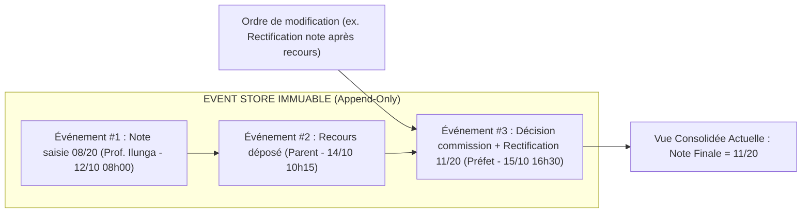
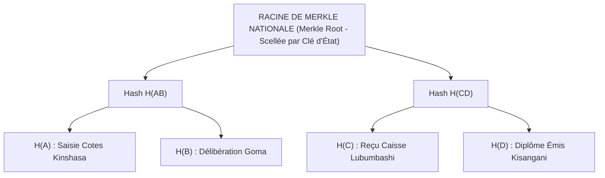

# TOME 9 — GOUVERNANCE DES DONNÉES ET CYBERSÉCURITÉ
## 155. Historisation, Versionnement Inaltérable et Registre Cryptographique Merkle Tree

---

> **Positionnement :** Architecture Event Sourcing, journalisation append-only, arbres de Merkle et auditabilité forensique  
> **Autorité :** Conforme aux principes de non-répudiation et de preuve juridique républicaine (Constitution, Art. 8)  
> **Liaison amont :** Module 108 (Sécurité constitutionnelle), Module 152 (MCD) | **Liaison aval :** Module 156 (Qualité), Module 162 (Audit)

---

## 1. Objet et Portée du Sous-Tome

Dans les fraudes scolaires traditionnelles, un fonctionnaire corrompu ou un pirate informatique pénètre dans une base de données pour modifier discrètement une note ou ajouter un candidat non inscrit sur un procès-verbal. Dans ELLYSIUM, une telle falsification est techniquement impossible. Le système n'écrase jamais une donnée existante. Toute modification est un événement immuable scellé dans un **arbre de Merkle cryptographique (Merkle Tree)**, garantissant la reconstitution intégrale de la vérité à n'importe quel instant du passé.

---

## 2. Le Modèle Event Sourcing Append-Only

**Règle TECH-155-01** : Aucune commande SQL `UPDATE` ou `DELETE` n'est autorisée sur les tables d'actes scolaires. L'état d'un élève est le résultat du rejeu déterministe de la séquence chronologique de tous ses événements historiques.

---

## 3. L'Arbre de Merkle des Mutations Académiques

Toutes les heures, l'ensemble des événements académiques enregistrés dans la nation est agrégé dans un arbre de Merkle :

### 3.1 Preuve Cryptographique d'Inclusion (Merkle Proof)
Si un candidat conteste l'authenticité de sa note d'examen, le système produit une preuve d'inclusion de quelques kilo-octets (les hashes intermédiaires de la branche). Tout citoyen ou tribunal peut vérifier mathématiquement que la note figurait bien dans le registre d'État officiel à la date dite, sans avoir à parcourir les téraoctets de la base centrale.

---

## 4. Reconstitution Historique (Time-Travel Forensics)

Les corps d'inspection de l'État disposent d'un outil de voyage temporel :
- L'inspecteur peut requêter : *« Quel était l'état exact du carnet de cotes de la 4e Scientifique B le 12 novembre 2025 à 14h32 ? »*
- Le moteur réapplique les événements jusqu'à cet horodatage précis et restitue l'écran identique à ce que voyait le professeur à cette seconde exacte.

---

## 5. Verrous Techniques d'Immutabilité

| Réf. | Intitulé | Conséquence en cas de transgression |
|---|---|---|
| **VF-155-01** | Alerte de rupture de chaîne cryptographique | Si un hash d'événement ne correspond pas à la racine scellée lors de la vérification horaire, la table est immédiatement verrouillée en lecture seule et une alerte de compromission d'État est levée. |
| **VF-155-02** | Révocation des droits d'altération | Aucun rôle de super-administrateur ne possède de privilège `DROP TABLE` ou `TRUNCATE` sur les tables du journal d'événements. |

---

*Sous-tome rédigé conformément aux Normes documentaires ELLYSIUM — Fondations 04.*  
*Version 1.0 — Référence : ELLYSIUM/T9/155/v1.0*

---

## 7. Verrous Fonctionnels Critiques

| Réf. Verrou | Description Fonctionnelle et Technique | Conséquence en Cas de Violation |
| :--- | :--- | :--- |
| **`VF-155-03`** | **Append-only Event Store pour l'historique académique** | Aucune ligne du journal académique ne peut être modifiée ou supprimée. |
| **`VF-155-04`** | **Hash cryptographique de chaque événement** | Chaque événement académique est lié au précédent par hash SHA-256 (structure Merkle). |
| **`VF-155-05`** | **Vérification périodique de l'intégrité de la chaîne** | Audit automatisé mensuel détectant toute rupture dans la chaîne d'événements. |

---

*Sous-tome rédigé conformément aux Normes documentaires ELLYSIUM — Fondations 04.*
