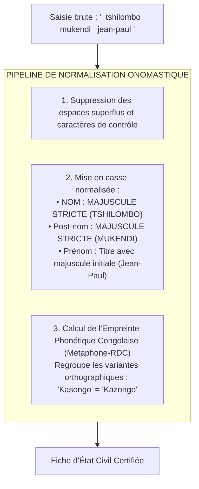

# TOME 9 — GOUVERNANCE DES DONNÉES ET CYBERSÉCURITÉ
## 156. Qualité des Données, Normalisation Onomastique et Dédoublonnage d'IUNE

---

> **Positionnement :** Hygiène métrologique, normalisation des patronymes congolais et détection des doubles inscriptions  
> **Autorité :** Conforme aux normes d'état civil de la RDC et aux exigences d'unicité de l'identifiant national (Tome 5, Module 60)  
> **Liaison amont :** Module 60 (Dossier IUNE), Module 152 (MCD) | **Liaison aval :** Module 157 (Mineurs), Module 161 (Sauvegardes)

---

## 1. Objet et Portée du Sous-Tome

Dans les registres scolaires en République Démocratique du Congo, les erreurs de frappe des patronymes, l'inversion entre nom, post-nom et prénom, ainsi que les fraudes par double inscription simultanée dans deux écoles différentes pour maximiser les chances aux examens d'État constituent une plaie métrologique endémique. Ce sous-tome spécifie l'algorithmique de **normalisation onomastique adaptée aux langues nationales**, le pipeline de nettoyage des données et le moteur anti-doublon d'IUNE.

---

## 2. Normalisation des Patronymes et État Civil Congolais

Les patronymes congolais présentent des particularités linguistiques (préfixes honorifiques, apostrophes, consonnes composées comme *Ng-*, *Mb-*, *Mv-*, *Tsh-*) souvent mutilées par des systèmes informatiques inadaptés.

---

## 3. Moteur de Détection des Doublons d'Élèves (Deduplication Engine)

Lors de toute inscription d'un élève (Tome 5, Module 59) :
1. Le système extrait un vecteur d'identification composé de :
   - `Hash(DateNaissance + Sexe + LieuNaissance)`
   - `EmpreintePhonétique(Nom + PostNom)`
   - `NumeroTelephoneTuteur`
2. Si une concordance supérieure à **$90\%$** est détectée avec un dossier déjà existant dans une autre école :
   - L'inscription n'est pas refusée brutalement, mais placée en état **SUSPECT_DOUBLON**.
   - Une alerte est transmise aux préfets des deux établissements et au pool d'inspection pour vérification contradictoire des pièces physiques (acte de naissance ou certificat d'études primaires).

---

## 4. Règle d'Unicité de l'IUNE à l'Échelle Nationale

**Règle QUALITÉ-156-01** : Un citoyen congolais ne peut posséder qu'un seul et unique IUNE tout au long de sa vie :
- Le format `CD-EL-YYYY-NNNNNNNN` intègre une clé de contrôle modulo-97 à deux chiffres en fin de séquence (norme type IBAN/ISO 7064).
- Toute saisie manuelle erronée d'un IUNE sur un bordereau est immédiatement interceptée côté client avant émission de la requête réseau.

---

## 5. Verrous Techniques de Qualité des Données

| Réf. | Intitulé | Conséquence en cas de transgression |
|---|---|---|
| **VF-156-01** | Interdiction formelle de double scolarité active | Le système bloque techniquement l'enrôlement d'un même IUNE dans deux classes ordinaires de plein exercice pour la même année scolaire. |
| **VF-156-02** | Validation stricte des dates de naissance | Tout dossier d'élève affichant un âge incohérent avec le niveau scolaire (ex. enfant de 6 ans inscrit en 4e des Humanités ou élève né dans le futur) est rejeté dès la couche de validation du modèle de domaine. |

---

*Sous-tome rédigé conformément aux Normes documentaires ELLYSIUM — Fondations 04.*  
*Version 1.0 — Référence : ELLYSIUM/T9/156/v1.0*
