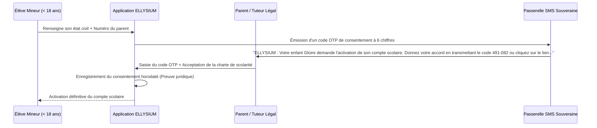
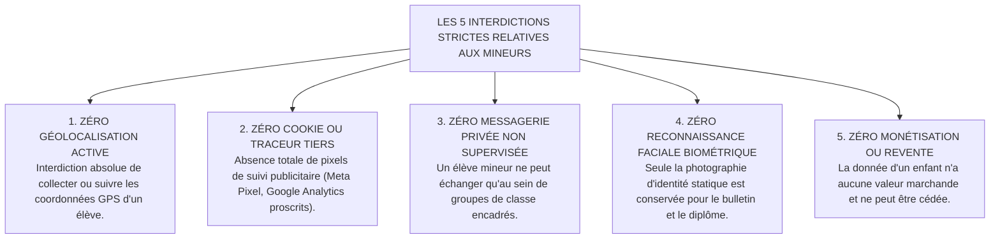

# TOME 9 — GOUVERNANCE DES DONNÉES ET CYBERSÉCURITÉ
## 157. Protection Renforcée des Données des Mineurs et Consentement Parental

---

> **Positionnement :** Sanctuarisation juridique et technique des données d'enfants, protocole de consentement parental et interdictions absolues  
> **Autorité :** Conforme à la Loi n° 09/001 du 10 janvier 2009 portant protection de l'enfant (RDC) et au Tome 2, Article 3  
> **Liaison amont :** Module 91 (Parcours parent), Module 153 (Cartographie) | **Liaison aval :** Module 158 (Chiffrement), Module 165 (Sécurité mobile)

---

## 1. Objet et Portée du Sous-Tome

Les enfants scolarisés au primaire et au secondaire sont des citoyens particulièrement vulnérables face aux risques numériques : exploitation commerciale de leur profil, harcèlement, fuite de photographies ou fichage précoce. ELLYSIUM érige un **bouclier de protection inviolable autour des données des mineurs de moins de 18 ans**, conditionnant tout traitement à l'autorité parentale et interdisant tout traçage intrusif de leur vie privée.

---

## 2. Protocole de Consentement Parental Vérifiable (OTP d'État)

**Règle MINEUR-157-01** : Aucun compte d'élève mineur ne peut être activé sans la confirmation expresse et vérifiée du titulaire de l'autorité parentale.

---

## 3. Les 5 Interdictions Absolues du Régime Mineur

Pour garantir l'intégrité morale et physique des enfants congolais :

---

## 4. Droit d'Accès et de Rectification Parental

Le parent ou tuteur légal dispose d'un droit de regard permanent depuis son tableau de bord :
- Consultation en temps réel de tous les devoirs, notes, appréciations et présences de son enfant.
- Possibilité de demander la correction immédiate d'une erreur d'état civil sur présentation de l'acte de naissance.
- Droit d'exiger la mise sous séquestre d'une interaction d'élève en cas d'incident disciplinaire ou de harcèlement suspecté.

---

## 5. Verrous Techniques de Sanctuarisation des Mineurs

| Réf. | Intitulé | Conséquence en cas de transgression |
|---|---|---|
| **VF-157-01** | Blocage automatique de l'activation sans accord parental | Tout compte mineur dont le consentement n'est pas validé sous **14 jours** est automatiquement suspendu et ses données temporaires purgées. |
| **VF-157-02** | Sanction de la collecte pirate de données d'enfants | Toute tentative d'injection d'un script tiers visant à extraire des données d'élèves mineurs entraîne le blocage immédiat du domaine et la saisine du Procureur de la République. |

---

*Sous-tome rédigé conformément aux Normes documentaires ELLYSIUM — Fondations 04.*  
*Version 1.0 — Référence : ELLYSIUM/T9/157/v1.0*
