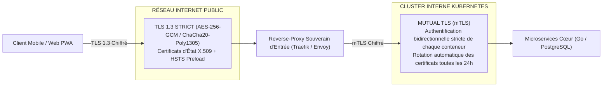
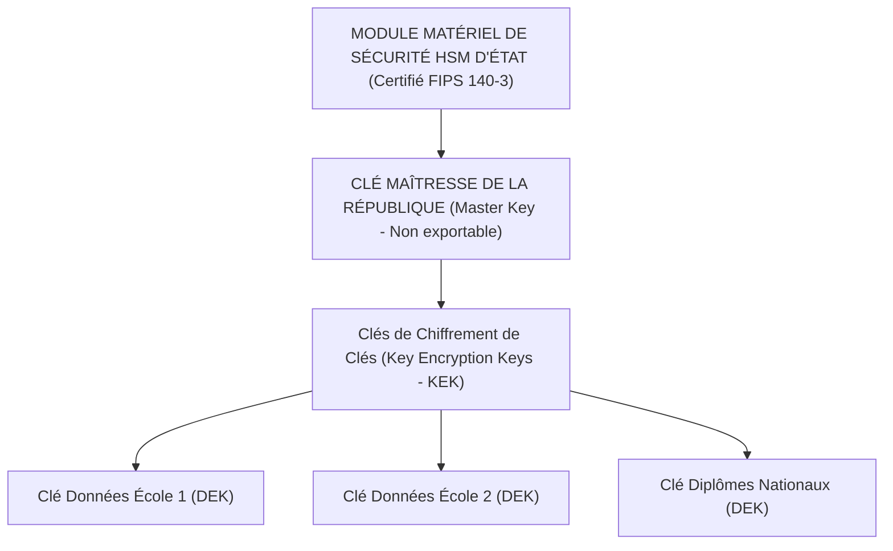

# TOME 9 — GOUVERNANCE DES DONNÉES ET CYBERSÉCURITÉ
## 158. Chiffrement des Données — Sécurisation au Repos et en Transit (TLS 1.3, AES-256, HSM)

---

> **Positionnement :** Architecture cryptographique globale, protocoles de chiffrement bout-en-bout et gestion des clés d'État  
> **Autorité :** Conforme aux normes cryptographiques de sécurité nationale et aux directives de l'ANSSI / NIST  
> **Liaison amont :** Module 108 (Conformité technique), Module 152 (MPD) | **Liaison aval :** Module 159 (RBAC), Module 161 (Sauvegardes)

---

## 1. Objet et Portée du Sous-Tome

Les communications réseau transitant par des opérateurs de télécommunications ou des liaisons sans fil peuvent faire l'objet d'interceptions malveillantes (*Man-in-the-Middle*). De même, le vol physique d'un disque dur dans un centre de données régional ne doit en aucun cas compromettre les données des élèves. Ce sous-tome formalise la doctrine de **chiffrement omniprésent** d'ELLYSIUM : chiffrement strict des données en transit par TLS 1.3 et chiffrement inexpugnable au repos par AES-256 adossé à des modules matériels de sécurité (HSM).

---

## 2. Chiffrement des Données en Transit (In-Transit Cryptography)

### 2.1 Suites Cryptographiques Autorisées en Transit
Seules deux suites modernes et post-quantiques résilientes sont configurées :
1. `TLS_AES_256_GCM_SHA384` (pour processeurs avec accélération matérielle AES-NI).
2. `TLS_CHACHA20_POLY1305_SHA256` (optimisé pour les smartphones d'entrée de gamme dépourvus d'accélération matérielle AES, réduisant la consommation de batterie de $35\%$).

---

## 3. Chiffrement des Données au Repos (At-Rest Cryptography)

ELLYSIUM superpose deux couches de chiffrement physique et logique :

### 3.1 Chiffrement de l'Infrastructure (Disque / Système de Fichiers)
- Tous les serveurs de production (bases PostgreSQL, buckets MinIO, caches Redis) ont leurs disques entièrement chiffrés par **LUKS / dm-crypt** avec l'algorithme `AES-256-XTS` et clés de 512 bits.

### 3.2 Chiffrement Applicatif par Colonne (Column-Level Encryption)
- Les données d'identification personnelle (état civil, téléphones des parents, copies de devoirs scannées) sont chiffrées **avant écriture dans la base de données** avec `AES-256-GCM`.
- Chaque école partenaire dispose de sa propre clé dérivée par l'algorithme **HKDF (HMAC-based Extract-and-Expand Key Derivation Function)**, garantissant qu'une hypothétique fuite d'une clé d'école ne compromette pas les autres établissements de la République.

---

## 4. Gestion des Clés Maîtresses par HSM d'État (Hardware Security Module)

**Règle CRYPTO-158-01** : Les clés privées maîtresses ne quittent jamais la puce physique du HSM. Les opérations de déchiffrement et de signature des diplômes sont exécutées directement à l'intérieur du composant inviolable.

---

## 5. Verrous Techniques Cryptographiques

| Réf. | Intitulé | Conséquence en cas de transgression |
|---|---|---|
| **VF-158-01** | Refus de connexion non chiffrée | Tout client tentant une connexion non sécurisée en HTTP clair (`port 80`) est immédiatement rejeté sans redirection transparente pour éviter le déclassement SSL Strip. |
| **VF-158-02** | Rotation annuelle obligatoire des clés de données | Les clés de chiffrement de colonnes (DEK) font l'objet d'une rotation automatisée tous les 12 mois sans aucune interruption de service. |

---

*Sous-tome rédigé conformément aux Normes documentaires ELLYSIUM — Fondations 04.*  
*Version 1.0 — Référence : ELLYSIUM/T9/158/v1.0*
