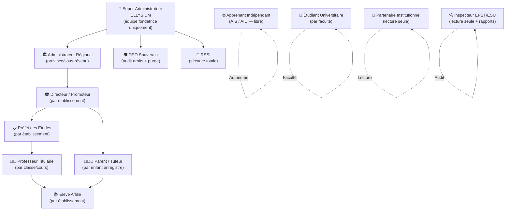
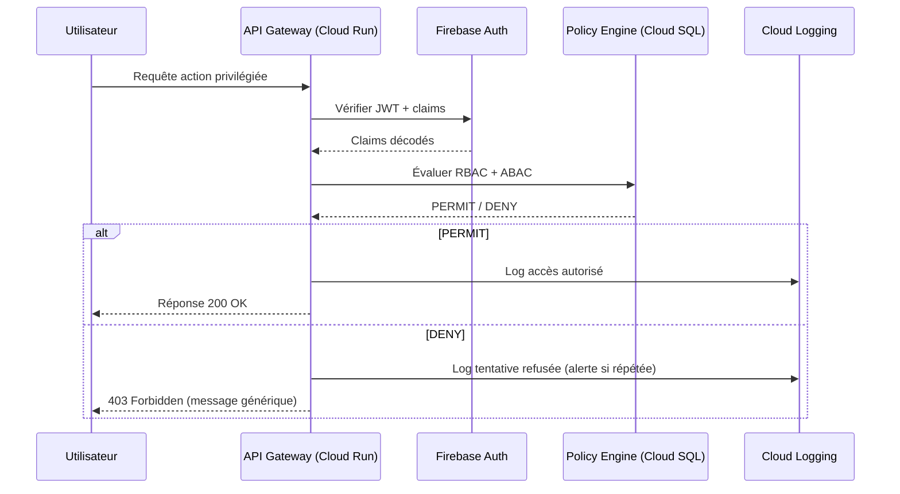

# Module 159 — Authentification et Gestion des Accès (RBAC/ABAC)

> **Positionnement :** Tome 9 — Gouvernance des Données & Cybersécurité · Module 159 sur 170
> **Autorité :** DPO Souverain ELLYSIUM / Responsable Sécurité des Systèmes d'Information (RSSI)
> **Liaison amont/aval :** ← Module 158 (Chiffrement) · Module 117 (Auth JWT) → Module 160 (MFA) →

---

## 1. Objet

Ce module définit le système de contrôle d'accès d'ELLYSIUM, combinant le **contrôle d'accès basé sur les rôles (RBAC)** et le **contrôle d'accès basé sur les attributs (ABAC)**. Il établit la matrice exhaustive des droits par rôle, les règles de délégation, d'escalade et de révocation, et garantit que chaque action sur la plateforme est autorisée par une règle explicite, vérifiée et journalisée.

---

## 2. Principes Constitutionnels

| Article | Disposition | Traduction technique |
|---|---|---|
| Art. 1 | Souveraineté des données | Les matrices d'accès sont stockées en Cloud SQL RDC |
| Art. 5 | Étanchéité pédagogie/finances | RBAC impose isolation dure entre les deux domaines |
| Art. 6 | Auxiliarité IA | L'IA ne peut jamais élever ses propres droits d'accès |
| Art. 8 | Traçabilité totale | Chaque vérification d'accès est loguée dans Cloud Logging |

---

## 3. Architecture RBAC/ABAC sur Firebase Authentication + Cloud SQL

### 3.1 Modèle hybride

```
RBAC (Rôles prédéfinis)
    ↓
ABAC (Attributs dynamiques : établissement, niveau, période)
    ↓
Décision d'accès : PERMIT | DENY | DENY_WITH_ESCALATION
```

### 3.2 Implémentation GCP

- **Firebase Authentication** : gestion des sessions, JWT, refresh tokens
- **Firebase Custom Claims** : rôles et attributs encodés dans le token JWT
- **Cloud SQL RLS (Row Level Security)** : isolation des données par établissement
- **Cloud Armor** : règles WAF bloquant les accès non autorisés au niveau réseau

---

## 4. Hiérarchie des Rôles ELLYSIUM (RBAC)



---

## 5. Matrice des Droits par Fonctionnalité

### 5.1 Module Pédagogique

| Fonctionnalité | Super-Admin | Directeur | Préfet | Enseignant | Élève affilié | AIS/AIU | Étudiant |
|---|:---:|:---:|:---:|:---:|:---:|:---:|:---:|
| Créer un cours | ✅ | ✅ | ✅ | ✅ | ❌ | ❌ | ❌ |
| Consulter un cours | ✅ | ✅ | ✅ | ✅ | ✅ | ✅ | ✅ |
| Soumettre un devoir | ❌ | ❌ | ❌ | ❌ | ✅ | ✅ | ✅ |
| Corriger un devoir | ✅ | ❌ | ❌ | ✅ | ❌ | ❌ | ❌ |
| Publier cotes/notes | ✅ | ❌ | ✅ | ✅ (draft) | ❌ | ❌ | ❌ |
| Sceller délibération | ✅ | ❌ | ✅ | ❌ | ❌ | ❌ | ❌ |
| Modifier cotes scellées | ✅ | ❌ | ❌ | ❌ | ❌ | ❌ | ❌ |

### 5.2 Module Financier (strictement isolé — Art. 5)

| Fonctionnalité | Super-Admin | Directeur | Préfet | Enseignant | Élève affilié | AIS/AIU | Parent |
|---|:---:|:---:|:---:|:---:|:---:|:---:|:---:|
| Voir le solde de caisse | ✅ | ✅ | ❌ | ❌ | ❌ | ❌ | ❌ |
| Encaisser un minerval | ✅ | ✅ | ❌ | ❌ | ❌ | ❌ | ❌ |
| Effectuer un paiement | ❌ | ❌ | ❌ | ❌ | ✅ | ❌ | ✅ |
| Exonérer un élève | ✅ | ✅ | ❌ | ❌ | ❌ | ❌ | ❌ |
| Éditer un rapport financier | ✅ | ✅ | ❌ | ❌ | ❌ | ❌ | ❌ |
| Voir ses propres paiements | ❌ | ❌ | ❌ | ❌ | ✅ | ❌ | ✅ |

### 5.3 Module Administration & Données

| Fonctionnalité | Super-Admin | Directeur | Préfet | DPO | RSSI | Partenaire | Inspecteur |
|---|:---:|:---:|:---:|:---:|:---:|:---:|:---:|
| Créer un établissement | ✅ | ❌ | ❌ | ❌ | ❌ | ❌ | ❌ |
| Gérer les utilisateurs | ✅ | ✅ (établ.) | ❌ | ✅ (audit) | ✅ | ❌ | ❌ |
| Exporter les données | ✅ | ✅ (établ.) | ❌ | ✅ | ✅ | ❌ | ✅ (read) |
| Purger des données | ✅ | ❌ | ❌ | ✅ | ❌ | ❌ | ❌ |
| Auditer les logs | ✅ | ❌ | ❌ | ✅ | ✅ | ❌ | ✅ (read) |
| Modifier Constitution | ✅ | ❌ | ❌ | ❌ | ❌ | ❌ | ❌ |

---

## 6. ABAC — Attributs Dynamiques

En complément du RBAC, les attributs suivants raffinent l'autorisation :

```sql
-- Table des attributs d'accès (Cloud SQL)
CREATE TABLE access_policy_attributes (
    user_id         UUID NOT NULL,
    attribute_key   TEXT NOT NULL,  -- 'etablissement_id', 'niveau', 'annee_academique', 'classe_id'
    attribute_value TEXT NOT NULL,
    valid_from      TIMESTAMPTZ DEFAULT NOW(),
    valid_until     TIMESTAMPTZ,
    granted_by      UUID NOT NULL,
    PRIMARY KEY (user_id, attribute_key, attribute_value)
);
```

### Règles ABAC critiques

```
RULE: Un enseignant ne peut corriger QUE les devoirs de SES classes.
RULE: Un directeur ne peut voir QUE les données de SON établissement.
RULE: Un parent ne peut voir QUE les données de SES enfants enregistrés.
RULE: Un partenaire ne peut accéder QUE pendant l'année académique en cours.
RULE: Un inspecteur ne peut auditer QUE les établissements de SA circonscription.
```

---

## 7. Firebase Custom Claims — Structure du Token JWT

```json
{
  "uid": "firebase-uid-xxxx",
  "iune": "CD-EL-2025-01428590",
  "role": "ENSEIGNANT",
  "etablissement_ids": ["etab-001-kinshasa", "etab-007-lubumbashi"],
  "classe_ids": ["cl-6A-math", "cl-5B-physique"],
  "permissions": ["COURS_READ", "COURS_WRITE", "DEVOIR_CORRECT", "COTES_DRAFT"],
  "periode_academique": "2025-2026",
  "auth_level": 3,
  "mfa_verified": true,
  "last_elevation": null,
  "exp": 1754078400
}
```

---

## 8. Délégation et Escalade de Droits



### Escalade temporaire (Break Glass)

```
- Durée max : 4 heures
- Approbateurs requis : 2 (RSSI + DPO)
- Enregistrement : Cloud Logging + audit immuable
- Révocation : automatique à expiration ou manuelle
- Alerte : notification Google Workspace immédiate au Directeur Général
```

---

## 9. Révocation et Suspension

| Événement | Action automatique | Délai |
|---|---|---|
| Départ d'un enseignant | Révocation tous droits établissement | Immédiat |
| Suspension disciplinaire élève | Accès pédagogique révoqué | Immédiat |
| Fin d'année académique | Recertification des accès | 30 jours avant rentrée |
| Signalement de compromission | Suspension totale + reset MFA | < 5 minutes |
| Tentatives d'accès répétées (> 5/min) | Blocage temporaire 15 min | Automatique |
| Inactivité > 180 jours | Mise en veille du compte | Automatique + notification |

---

## 10. Row Level Security — Cloud SQL

```sql
-- Politique d'isolation par établissement (exemple enseignant)
CREATE POLICY enseignant_isolation ON cours
    FOR ALL
    TO role_enseignant
    USING (
        etablissement_id = current_setting('app.current_etablissement_id')::UUID
        AND classe_id = ANY(string_to_array(
            current_setting('app.current_classe_ids'), ','
        )::UUID[])
    );

-- Politique d'isolation financière (Art. 5)
CREATE POLICY finance_isolation ON transactions
    FOR ALL
    TO role_pédagogique
    USING (FALSE);  -- Accès total interdit aux rôles pédagogiques
```

---

## 11. Verrous Fonctionnels

| ID | Règle | Niveau |
|---|---|---|
| VF-159-01 | Aucun rôle pédagogique n'accède au module financier | CONSTITUTIONNEL |
| VF-159-02 | L'IA (Vertex AI) opère sous un rôle de service sans droits d'élévation | CONSTITUTIONNEL |
| VF-159-03 | Toute modification de la matrice des droits est loguée et horodatée | OBLIGATOIRE |
| VF-159-04 | Le DPO peut auditer mais jamais modifier les données pédagogiques | OBLIGATOIRE |
| VF-159-05 | Les cotes scellées sont en lecture seule pour tous sauf Super-Admin | OBLIGATOIRE |
| VF-159-06 | Pas de droits accordés sans MFA vérifié (niveau 2+) | OBLIGATOIRE |

---

*Sous-tome rédigé conformément aux Normes documentaires ELLYSIUM — Fondations 04.*
