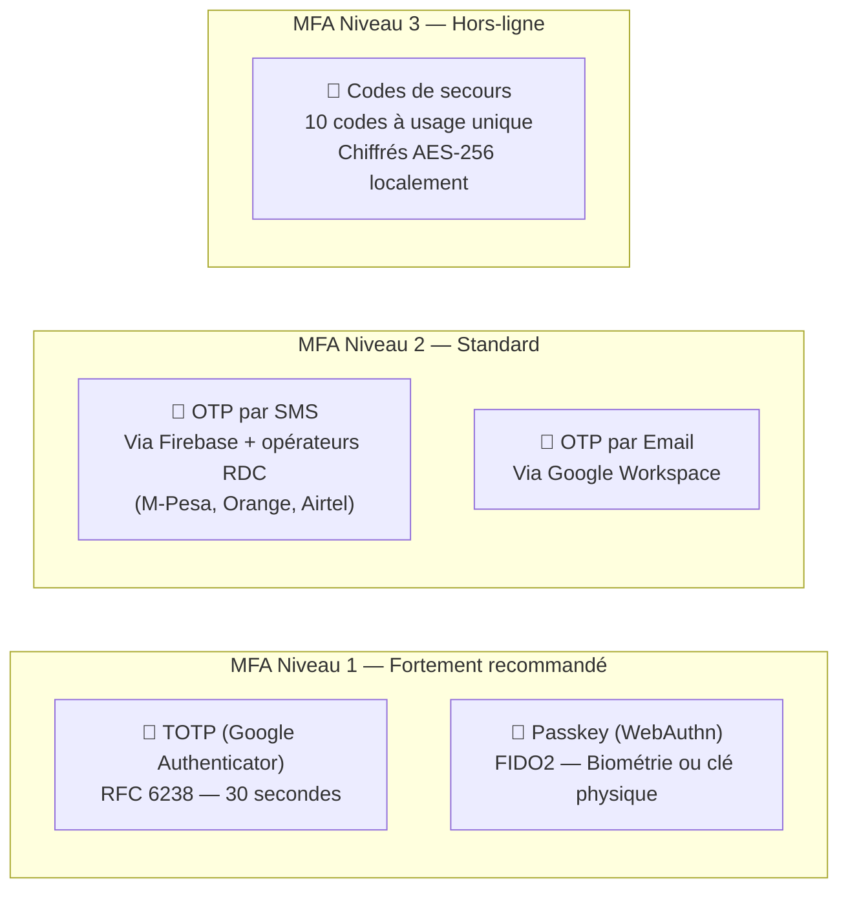
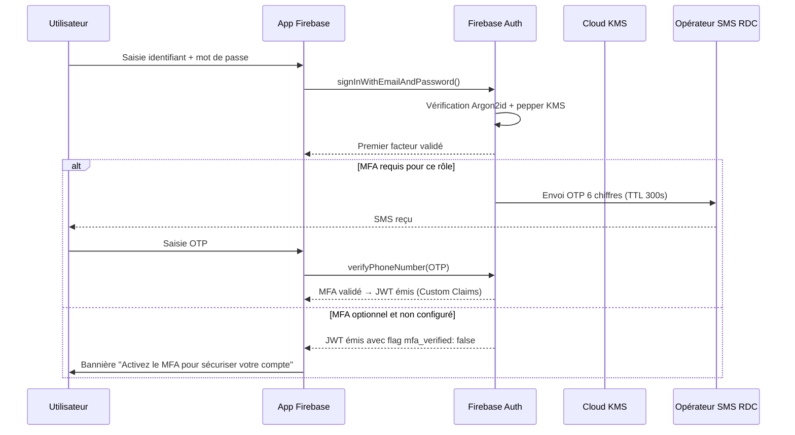

# Module 160 — Politique de Mots de Passe et Double Authentification (MFA)

> **Positionnement :** Tome 9 — Gouvernance des Données & Cybersécurité · Module 160 sur 170
> **Autorité :** RSSI ELLYSIUM / DPO Souverain
> **Liaison amont/aval :** ← Module 159 (RBAC/ABAC) · Module 117 (Argon2id) → Module 161 (Sauvegardes) →

---

## 1. Objet

Ce module définit la politique de gestion des mots de passe et d'authentification multi-facteurs (MFA) d'ELLYSIUM. Il établit les règles de complexité, de stockage, de renouvellement et de compromission, ainsi que les mécanismes MFA adaptés au contexte congolais (connectivité limitée, appareils d'entrée de gamme, population diverse incluant des mineurs).

---

## 2. Principes directeurs

- **Sécurité sans friction excessive** : l'authentification ne doit pas décourager l'usage
- **Adaptation au contexte RDC** : SMS disponible même sans internet haut débit
- **Protection des mineurs** : règles spéciales pour les moins de 18 ans
- **Souveraineté** : Firebase Authentication + Cloud KMS, sans dépendance à des tiers non-Google

---

## 3. Politique de Mots de Passe

### 3.1 Règles de complexité par niveau de rôle

| Rôle | Longueur min | Majuscule | Chiffre | Spécial | Expiration |
|---|:---:|:---:|:---:|:---:|:---:|
| Super-Admin / RSSI / DPO | 20 caractères | ✅ | ✅ | ✅ | 30 jours |
| Directeur / Promoteur | 14 caractères | ✅ | ✅ | ✅ | 60 jours |
| Préfet des études | 12 caractères | ✅ | ✅ | ✅ | 90 jours |
| Enseignant | 10 caractères | ✅ | ✅ | ❌ | 180 jours |
| Parent / Tuteur | 8 caractères | ✅ | ✅ | ❌ | 365 jours |
| Élève (≥ 15 ans) | 8 caractères | ❌ | ✅ | ❌ | Jamais forcé |
| Élève (< 15 ans) | 6 caractères | ❌ | ✅ | ❌ | Géré par parent |
| AIS / AIU | 8 caractères | ❌ | ✅ | ❌ | Jamais forcé |

### 3.2 Règles complémentaires

```
✅ Vérification en temps réel contre les 10 000 000 mots de passe les plus communs (Have I Been Pwned)
✅ Interdiction des 24 derniers mots de passe (historique haché)
✅ Interdiction du prénom, nom, IUNE dans le mot de passe
✅ Indicateur de force en temps réel (barre colorée) sur l'interface
✅ Génération assistée de mots de passe forts (bouton "générer")
✅ Délai exponentiel entre tentatives : 1s → 2s → 4s → 8s → blocage 15 min
✅ Alerte email/SMS après 3 tentatives échouées
```

### 3.3 Stockage — Argon2id (via Firebase Auth + Cloud KMS)

```
Algorithme : Argon2id (variant recommandé OWASP 2024)
Paramètres production :
  - m (mémoire)    : 64 Mo
  - t (itérations) : 3
  - p (parallélisme): 4
  - Salt           : 32 octets aléatoires (CSPRNG)
  - Tag length     : 64 octets

Clé de poivre (pepper) :
  - Stockée dans Cloud KMS (jamais en base de données)
  - Rotation annuelle avec re-hachage progressif
```

---

## 4. Authentification Multi-Facteurs (MFA)

### 4.1 Méthodes MFA disponibles (Firebase Authentication)



### 4.2 MFA obligatoire vs. recommandé

| Rôle | MFA Obligatoire | Méthode imposée |
|---|:---:|---|
| Super-Admin | ✅ OBLIGATOIRE | TOTP + Passkey (double facteur) |
| RSSI / DPO | ✅ OBLIGATOIRE | TOTP ou Passkey |
| Directeur / Promoteur | ✅ OBLIGATOIRE | TOTP ou SMS |
| Préfet des études | ✅ OBLIGATOIRE | TOTP ou SMS |
| Enseignant | ✅ OBLIGATOIRE | TOTP, SMS ou Email |
| Parent / Tuteur | ⚠️ FORTEMENT RECOMMANDÉ | SMS ou Email |
| Élève (≥ 15 ans) | 💡 RECOMMANDÉ | SMS ou Email |
| Élève (< 15 ans) | 💡 OPTIONNEL | Email parental uniquement |
| AIS / AIU | 💡 RECOMMANDÉ | SMS ou Email |
| Partenaire institutionnel | ✅ OBLIGATOIRE | TOTP ou Passkey |

### 4.3 Flux MFA sur Firebase Authentication



---

## 5. Gestion des Comptes Compromis

### 5.1 Détection automatique

```python
# Règles de détection de compromission (Cloud Functions)
ANOMALIES = [
    "connexion depuis nouveau pays/ville",
    "connexion à heure inhabituelle (écart > 4σ)",
    "connexion depuis 2 IPs simultanées",
    "token utilisé après révocation",
    "velocity attack (> 10 connexions / heure)",
    "credential stuffing pattern détecté"
]
```

### 5.2 Procédure de compromission

```
T+0s   : Détection anomalie → suspension immédiate du compte
T+0s   : Révocation de TOUS les tokens actifs (Firebase Auth revokeRefreshTokens)
T+30s  : Notification SMS + Email à l'utilisateur
T+1min : Alerte au RSSI via Cloud Monitoring
T+5min : Log dans Cloud Logging avec niveau CRITICAL
T+24h  : Rapport automatique au DPO si données sensibles potentiellement exposées
```

---

## 6. Récupération de Compte

### 6.1 Flux de récupération standard

```
1. Utilisateur clique "Mot de passe oublié"
2. Saisie de l'email ou du numéro de téléphone
3. Envoi d'un lien de réinitialisation (TTL : 15 minutes, usage unique)
4. Vérification MFA (si configuré) avant réinitialisation
5. Nouveau mot de passe saisi (règles de complexité vérifiées)
6. Invalidation de toutes les sessions précédentes
```

### 6.2 Récupération pour les élèves mineurs

```
- La récupération passe par le compte parent/tuteur validé
- Un OTP est envoyé au numéro du parent
- L'élève ne peut pas réinitialiser seul s'il est < 15 ans
- Le Préfet des études peut déclencher une réinitialisation supervisée
```

---

## 7. Authentification Hors-Ligne (Mode RDC)

Conforme à l'Article 2 Constitutionnel (Local-First) :

```
- Token offline valable 30 jours (chiffré AES-256-GCM, stocké localement)
- Vérification locale de l'empreinte Argon2id du PIN (4-6 chiffres)
- PIN distinct du mot de passe principal
- Synchronisation à la prochaine connexion : invalidation si révocation détectée
- Biométrie Android (CameraX / BiometricPrompt) possible pour déverrouiller le token offline
```

---

## 8. Verrous Fonctionnels

| ID | Règle | Niveau |
|---|---|---|
| VF-160-01 | Les Super-Admins ne peuvent JAMAIS se connecter sans double MFA | CONSTITUTIONNEL |
| VF-160-02 | Les mots de passe ne sont jamais stockés en clair, même temporairement | OBLIGATOIRE |
| VF-160-03 | Les liens de réinitialisation expirent en 15 minutes et sont à usage unique | OBLIGATOIRE |
| VF-160-04 | La récupération de compte mineur passe obligatoirement par le parent | OBLIGATOIRE |
| VF-160-05 | Aucune interface admin n'est accessible sans MFA actif | OBLIGATOIRE |
| VF-160-06 | Le poivre (pepper) est conservé dans Cloud KMS, jamais en base de données | OBLIGATOIRE |

---

*Sous-tome rédigé conformément aux Normes documentaires ELLYSIUM — Fondations 04.*
