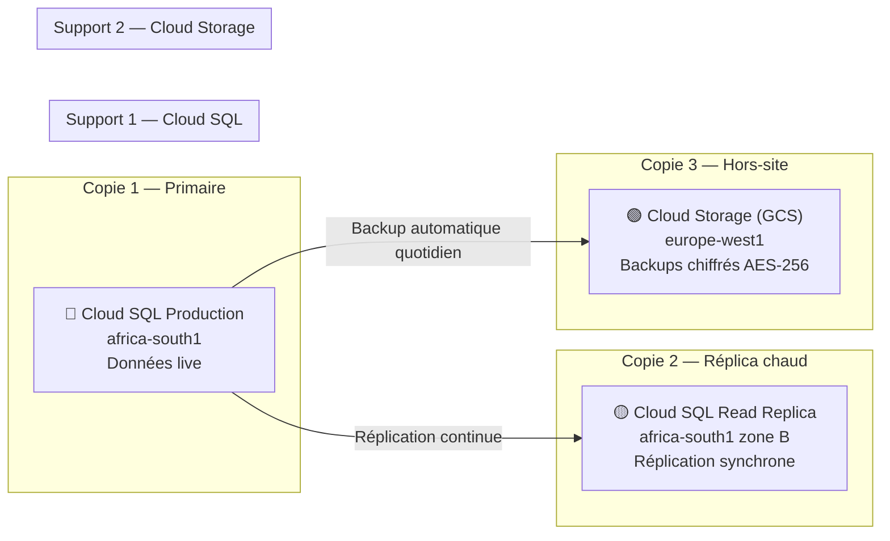
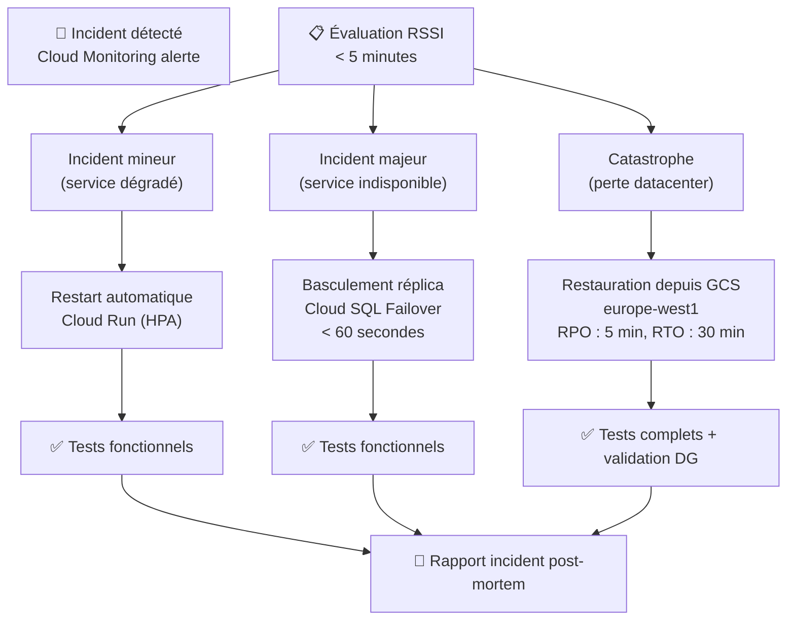

# Module 161 — Sauvegardes et Plans de Reprise (Stratégie 3-2-1)

> **Positionnement :** Tome 9 — Gouvernance des Données & Cybersécurité · Module 161 sur 170
> **Autorité :** RSSI ELLYSIUM / Administrateur Infrastructure GCP
> **Liaison amont/aval :** ← Module 160 (MFA) · Module 114 (Bases de données) → Module 162 (Audit) →

---

## 1. Objet

Ce module définit la stratégie de sauvegarde, de restauration et de reprise après sinistre d'ELLYSIUM selon la règle **3-2-1** (3 copies, 2 supports différents, 1 hors-site). Il garantit la continuité de service pour les 65 000+ utilisateurs simultanés et la préservation irréversible des données académiques (diplômes, cotes, dossiers) sur une durée minimale de 50 ans conformément à l'Article 12 de la Constitution.

---

## 2. Règle 3-2-1 appliquée à ELLYSIUM



---

## 3. Types de Sauvegardes

### 3.1 Sauvegardes automatiques Cloud SQL

| Type | Fréquence | Rétention | Chiffrement | Localisation |
|---|---|---|---|---|
| Snapshot automatique | Quotidien (02h00 UTC+2) | 30 jours | AES-256 (Cloud KMS) | africa-south1 |
| Point-in-time recovery (PITR) | Continue (binlogs) | 7 jours | AES-256 (Cloud KMS) | africa-south1 |
| Sauvegarde hebdomadaire | Dimanche 03h00 | 12 semaines | AES-256 (Cloud KMS) | africa-south1 + europe-west1 |
| Sauvegarde mensuelle | 1er du mois | 24 mois | AES-256 (Cloud KMS) | europe-west1 |
| Archive annuelle | 31 décembre | 50 ans | AES-256 + envelope encryption | europe-west1 + GCS Coldline |

### 3.2 Sauvegardes Cloud Storage (fichiers, médias)

```
- Versioning GCS activé sur tous les buckets de production
- Lifecycle policy : Standard → Nearline (30j) → Coldline (90j) → Archive (365j)
- Réplication cross-région : africa-south1 ↔ europe-west1
- Rétention des diplômes numériques : 50 ans minimum (GCS Archive class)
- Objets immuables (Object Lock) : diplômes, bulletins scellés, PV de délibération
```

### 3.3 Sauvegardes des secrets et configurations

```
- Cloud KMS : rotation des clés sauvegardée automatiquement
- Secret Manager : versions archivées, suppression soft (30 jours)
- Artifact Registry : images Docker taguées + immuables en production
- IaC (Terraform) : état sauvegardé dans GCS + versioning activé
```

---

## 4. Objectifs de Reprise

### 4.1 RPO et RTO par niveau de criticité

| Niveau | Données concernées | RPO (perte max) | RTO (temps reprise max) |
|---|---|---|---|
| **CRITIQUE** | Diplômes, cotes scellées, identités | 0 (synchrone) | < 15 minutes |
| **HAUTE** | Cours en cours, paiements, sessions | < 5 minutes | < 30 minutes |
| **NORMALE** | Forums, messages, médias cours | < 1 heure | < 2 heures |
| **BASSE** | Logs d'audit, statistiques, analytics | < 24 heures | < 8 heures |

### 4.2 SLO de disponibilité par service

| Service | SLO cible | SLO garanti GCP |
|---|---|---|
| Plateforme pédagogique (lecture) | 99.9% | 99.95% (Cloud Run) |
| Module examens / délibérations | 99.95% | 99.99% (Cloud SQL + réplica) |
| Mobile Money / paiements | 99.99% | 99.99% (Cloud Run + Pub/Sub) |
| Authentification | 99.99% | 99.99% (Firebase Auth) |
| Landing pages publiques | 99.9% | 99.99% (Firebase Hosting + CDN) |

---

## 5. Plan de Reprise après Sinistre (PRA / DRP)



---

## 6. Procédures de Restauration

### 6.1 Restauration Cloud SQL PITR

```bash
# Restaurer à un instant précis (exemple : avant une suppression accidentelle)
gcloud sql backups restore BACKUP_ID \
  --restore-instance=ellysium-prod-pg16 \
  --backup-instance=ellysium-prod-pg16 \
  --project=ellysium-prod

# Restauration point-in-time
gcloud sql instances clone ellysium-prod-pg16 ellysium-restore-temp \
  --point-in-time="2026-09-17T14:30:00.000Z"
```

### 6.2 Restauration fichiers GCS

```bash
# Restaurer une version précédente d'un fichier
gcloud storage cp \
  gs://ellysium-prod-data/diplomes/CD-EL-2025-01428590.pdf#1696000000000000 \
  gs://ellysium-prod-data/diplomes/CD-EL-2025-01428590.pdf
```

---

## 7. Tests de Restauration

| Test | Fréquence | Responsable | Critère de succès |
|---|---|---|---|
| Test de restauration Cloud SQL | Mensuel | RSSI | RTO < 30 min, données intègres |
| Simulation bascule réplica | Trimestriel | RSSI + DBA | RTO < 60 sec, zéro perte de données |
| Test DRP complet (simulation sinistre) | Semestriel | RSSI + DG | RTO < 2h, RPO < 5 min |
| Vérification intégrité backups | Hebdomadaire | Automatique (Cloud Functions) | Hash SHA-256 identique |
| Restauration aléatoire (audit) | Trimestriel | DPO | 100% des fichiers restaurables |

---

## 8. Sécurité des Sauvegardes

```
✅ Chiffrement AES-256-GCM avec clé dans Cloud KMS (régionale africa-south1)
✅ Accès aux backups : rôle dédié "backup-restorer" uniquement (IAM minimal)
✅ Logs d'accès aux backups dans Cloud Logging (immuables, durée 7 ans)
✅ Les backups des diplômes sont verrouillés (Object Lock) : non supprimables
✅ Séparation des comptes : prod / backup / restore (3 comptes IAM distincts)
✅ MFA obligatoire pour toute opération de restauration en production
```

---

## 9. Verrous Fonctionnels

| ID | Règle | Niveau |
|---|---|---|
| VF-161-01 | Les diplômes et bulletins scellés sont conservés 50 ans minimum | CONSTITUTIONNEL |
| VF-161-02 | Les backups sont chiffrés avant transfert vers GCS | OBLIGATOIRE |
| VF-161-03 | Tests de restauration mensuels documentés et signés par le RSSI | OBLIGATOIRE |
| VF-161-04 | RPO des données critiques (diplômes) = 0 (réplication synchrone) | OBLIGATOIRE |
| VF-161-05 | Aucun backup n'est stocké sur infrastructure non-Google | CONSTITUTIONNEL |
| VF-161-06 | La suppression d'un backup de diplôme est impossible sans approbation DPO + DG | OBLIGATOIRE |

---

*Sous-tome rédigé conformément aux Normes documentaires ELLYSIUM — Fondations 04.*
