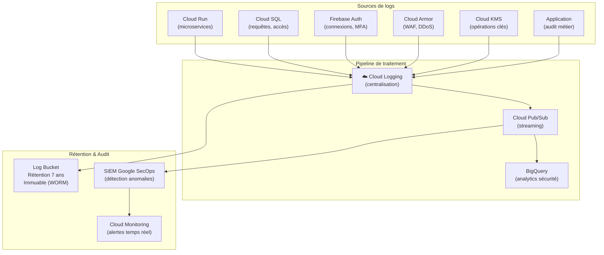

# Module 162 — Audit de Sécurité et Journalisation

> **Positionnement :** Tome 9 — Gouvernance des Données & Cybersécurité · Module 162 sur 170
> **Autorité :** RSSI ELLYSIUM / DPO Souverain / Auditeur Externe
> **Liaison amont/aval :** ← Module 161 (Sauvegardes) · Module 146 (Journal IA) → Module 163 (Incidents) →

---

## 1. Objet

Ce module définit le dispositif complet d'audit de sécurité d'ELLYSIUM : journalisation exhaustive de toutes les opérations sensibles, tests d'intrusion périodiques, revues de code sécurité, conformité aux standards internationaux (ISO 27001, SOC 2) et procédures de signalement. Tout événement sur la plateforme est tracé, horodaté, signé et conservé de manière inaltérable.

---

## 2. Architecture de Journalisation (Google Cloud Logging)



---

## 3. Catalogue des Événements Audités

### 3.1 Événements Critiques (alertes immédiates)

| Catégorie | Événement | Délai d'alerte |
|---|---|---|
| Authentification | Connexion Super-Admin | < 1 min |
| Authentification | Échec MFA répété (> 3) | < 30 sec |
| Données | Modification cotes scellées | Immédiat |
| Données | Export de données > 1000 enregistrements | < 5 min |
| Infrastructure | Modification règles IAM | Immédiat |
| Infrastructure | Suppression bucket GCS | Immédiat |
| Clés | Rotation ou suppression clé KMS | Immédiat |
| Finances | Transaction > 10 000 USD | < 1 min |
| IA | Tentative injection prompt détectée | < 30 sec |

### 3.2 Événements Standards (journalisation)

```
- Toute connexion utilisateur (succès + échec) avec IP, user-agent, géolocalisation
- Toute action CRUD sur les données personnelles
- Toute modification de la matrice RBAC
- Toute opération de backup / restauration
- Toute escalade de droits (Break Glass)
- Toute requête API vers Vertex AI
- Tout paiement Mobile Money (montant, opérateur, statut)
- Toute génération de diplôme ou bulletin
- Tout accès DPO aux données personnelles
```

---

## 4. Structure du Log d'Audit Métier

```json
{
  "event_id": "uuid-v4",
  "timestamp": "2026-09-17T16:42:15.123Z",
  "event_type": "COTES_MODIFICATION_TENTATIVE",
  "severity": "WARNING",
  "actor": {
    "iune": "CD-EL-2025-00000001",
    "role": "PREFET_ETUDES",
    "ip": "196.216.x.x",
    "user_agent": "Mozilla/5.0 (Android 14...)",
    "mfa_verified": true
  },
  "resource": {
    "type": "bulletin",
    "id": "bull-2025-6A-014",
    "etablissement": "etab-001-kinshasa",
    "etat_avant_action": "SCELLE"
  },
  "action": "WRITE_ATTEMPT",
  "result": "DENIED",
  "reason": "VF-159-05: Cotes scellées en lecture seule",
  "merkle_hash": "sha256:abc123...",
  "chain_prev_hash": "sha256:def456..."
}
```

---

## 5. Intégrité des Logs — Chaîne de Merkle

Chaque entrée de log d'audit est chaînée cryptographiquement :

```
hash(n) = SHA-256(event_data(n) || hash(n-1))
```

- **Détection de falsification** : toute modification d'un log casse la chaîne
- **Vérification périodique** : Cloud Functions vérifie l'intégrité toutes les heures
- **Ancrage blockchain** : empreinte hebdomadaire ancrée (optionnel, selon budget)
- **WORM storage** : Log Bucket avec rétention verrouillée 7 ans (immuable GCP)

---

## 6. Tests d'Intrusion (Pentests)

### 6.1 Calendrier des pentests

| Type | Fréquence | Exécutant | Périmètre |
|---|---|---|---|
| DAST automatique (OWASP ZAP) | Hebdomadaire | CI/CD (Cloud Build) | APIs REST + frontend |
| Pentest white-box interne | Trimestriel | RSSI | Architecture complète |
| Pentest black-box externe | Semestriel | Cabinet agréé | APIs publiques, auth |
| Pentest mobile (Android/iOS) | Annuel | Cabinet agréé | App Flutter |
| Red Team exercise | Annuel | Équipe externe | Scénario APT complet |
| Test social engineering | Annuel | Cabinet agréé | Personnel ELLYSIUM |

### 6.2 Méthodologie pentest

```
Standard : OWASP Testing Guide v4.2 + PTES (Penetration Testing Execution Standard)
Scope autorisé :
  ✅ ellysium.cd (production — window de test agréée)
  ✅ staging.ellysium.cd
  ✅ APIs *.ellysium.cd
  ❌ Infrastructure Google (hors périmètre — GCP Bug Bounty)
  ❌ Données réelles de production (données synthétiques uniquement)
```

### 6.3 Traitement des vulnérabilités

| Criticité (CVSS) | Délai de correction | Responsable |
|---|---|---|
| Critique (9.0–10.0) | < 24 heures | RSSI + Dev Lead (astreinte) |
| Haute (7.0–8.9) | < 7 jours | RSSI + Dev Lead |
| Moyenne (4.0–6.9) | < 30 jours | Dev Lead |
| Faible (0.1–3.9) | < 90 jours | Dev team |
| Informationnelle | Prochaine version | Dev team |

---

## 7. Revues de Sécurité du Code

```
- SAST : Semgrep + CodeQL (Cloud Build — bloquant si critique)
- Dépendances : Dependabot + OSV Scanner (alerte hebdomadaire)
- Secrets : Trufflehog (vérification pré-commit + CI)
- Infrastructure : tfsec (Terraform) + Checkov
- Conteneurs : Container Analysis (Artifact Registry) + Trivy
- Revue manuelle : pour tout code touchant auth, paiements, cotes
```

---

## 8. Conformité et Certifications cibles

| Standard | Objectif | Horizon |
|---|---|---|
| ISO 27001 | Certification SMSI | An 3 |
| SOC 2 Type II | Rapport annuel | An 2 |
| RGPD / Loi RDC 15/023 | Conformité permanente | Depuis lancement |
| PCI-DSS Level 4 | Transactions Mobile Money | An 1 |
| OWASP ASVS Level 2 | Applications web et mobile | An 1 |

---

## 9. Verrous Fonctionnels

| ID | Règle | Niveau |
|---|---|---|
| VF-162-01 | Les logs d'audit sont immuables (WORM) et conservés 7 ans minimum | OBLIGATOIRE |
| VF-162-02 | La chaîne de Merkle est vérifiée toutes les heures automatiquement | OBLIGATOIRE |
| VF-162-03 | Tout pentest doit être préalablement autorisé par le RSSI et le DG | OBLIGATOIRE |
| VF-162-04 | Les vulnérabilités critiques sont corrigées en < 24 heures | OBLIGATOIRE |
| VF-162-05 | Les logs de Cloud KMS ne peuvent jamais être supprimés | CONSTITUTIONNEL |
| VF-162-06 | Tout accès DPO aux données personnelles est lui-même audité | OBLIGATOIRE |

---

*Sous-tome rédigé conformément aux Normes documentaires ELLYSIUM — Fondations 04.*
