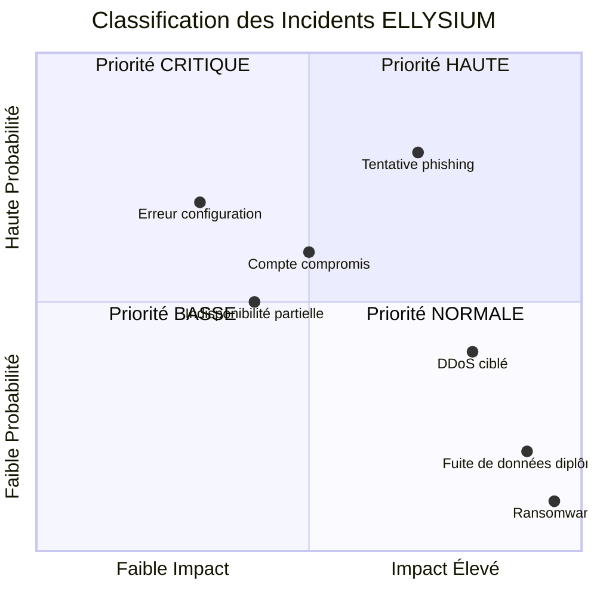
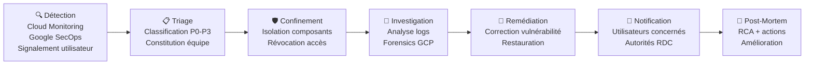

# Module 163 — Gestion des Incidents et des Violations de Données

> **Positionnement :** Tome 9 — Gouvernance des Données & Cybersécurité · Module 163 sur 170
> **Autorité :** RSSI ELLYSIUM / DPO Souverain / Cellule de Crise
> **Liaison amont/aval :** ← Module 162 (Audit) · Module 161 (Sauvegardes) → Module 164 (OWASP) →

---

## 1. Objet

Ce module définit le cadre complet de gestion des incidents de sécurité d'ELLYSIUM : détection, classification, réponse, communication, remédiation et retour d'expérience. Il inclut les obligations légales de notification en cas de violation de données personnelles conformément à la loi RDC n° 15/023 et aux principes RGPD.

---

## 2. Classification des Incidents



| Niveau | Description | Exemples | Délai réponse |
|---|---|---|---|
| **P0 — CRITIQUE** | Violation massive, ransomware, accès admin compromis | Exfiltration données 10 000+ élèves | < 15 min |
| **P1 — GRAVE** | Violation ciblée, indisponibilité majeure > 1h | Fuite cotes d'un établissement | < 30 min |
| **P2 — MODÉRÉ** | Incident limité, dégradation de service | Compte enseignant compromis | < 2h |
| **P3 — MINEUR** | Anomalie sans impact significatif | Tentative de connexion bloquée | < 24h |

---

## 3. Cycle de Vie d'un Incident



---

## 4. Procédure P0 — Incident Critique (détail)

```
T+00:00  Alerte reçue (Cloud Monitoring / Google SecOps)
T+05:00  RSSI notifié (SMS + appel téléphonique)
T+10:00  Cellule de crise activée (RSSI + DPO + DG + Dev Lead)
T+15:00  CONFINEMENT : isolation des composants affectés
           → Cloud Armor : blocage IPs sources
           → Firebase Auth : révocation tokens compromis
           → Cloud Run : traffic splitting à 0% si nécessaire
T+30:00  INVESTIGATION : analyse des logs Cloud Logging (forensics)
T+60:00  ÉVALUATION de la violation : données affectées ? combien ? quel type ?
T+72:00  NOTIFICATION légale (si violation données personnelles)
           → Autorité de protection des données RDC
           → Utilisateurs affectés (email/SMS)
T+7j     REMÉDIATION complète + rapport post-mortem
T+30j    Audit de sécurité post-incident
```

---

## 5. Obligations Légales de Notification

### 5.1 Délais légaux (loi RDC n° 15/023 + principes RGPD)

| Destinataire | Délai | Déclencheur |
|---|---|---|
| Autorité RDC de protection des données | 72 heures | Violation confirmée de données personnelles |
| Utilisateurs directement affectés | Sans délai indu (< 7 jours) | Risque élevé pour leurs droits |
| EPST / ESU (si données élèves/étudiants) | 48 heures | Violation données mineurs ou académiques |
| Partenaires institutionnels concernés | 48 heures | Selon contrat de partenariat |

### 5.2 Contenu de la notification aux utilisateurs

```
Modèle de notification (Email + SMS) :

Objet : [ELLYSIUM] Information importante concernant la sécurité de votre compte

Cher(e) [Prénom],

Nous vous informons qu'un incident de sécurité s'est produit entre [date_debut]
et [date_fin] susceptible d'avoir affecté [description_données_concernées].

Ce qui a été affecté : [liste précise]
Ce qui N'A PAS été affecté : [liste précise]
Ce que nous avons fait : [actions de confinement]
Ce que vous devez faire : [changer mot de passe / activer MFA]

Pour toute question : dpo@ellysium.cd | +243-XXX-XXX-XXX

L'équipe ELLYSIUM
```

---

## 6. Cellule de Crise ELLYSIUM

| Rôle | Responsabilité | Contact astreinte |
|---|---|---|
| RSSI (Incident Commander) | Pilotage technique de la réponse | 24h/24 7j/7 |
| DPO Souverain | Obligations légales, notification autorités | 24h/24 |
| Directeur Général | Décisions stratégiques, communication externe | 24h/24 |
| Dev Lead Backend | Investigation technique, correctifs | Astreinte P0/P1 |
| Dev Lead Infra (GCP) | Isolation, restauration, forensics | Astreinte P0/P1 |
| Responsable Communication | Communiqués publics si nécessaire | Jours ouvrables |

---

## 7. Registre des Incidents

```sql
-- Table registre_incidents (Cloud SQL)
CREATE TABLE registre_incidents (
    id              UUID PRIMARY KEY DEFAULT gen_random_uuid(),
    reference       TEXT UNIQUE NOT NULL,  -- 'INC-2026-001'
    date_detection  TIMESTAMPTZ NOT NULL,
    date_cloture    TIMESTAMPTZ,
    niveau          TEXT NOT NULL CHECK (niveau IN ('P0','P1','P2','P3')),
    statut          TEXT NOT NULL CHECK (statut IN ('OUVERT','EN_COURS','CLOS','ESCALADE')),
    description     TEXT NOT NULL,
    donnees_affectees TEXT[],  -- types de données personnelles touchées
    nb_personnes_affectees INTEGER DEFAULT 0,
    notification_autorite BOOLEAN DEFAULT FALSE,
    date_notification TIMESTAMPTZ,
    rapport_postmortem_url TEXT,
    created_by      UUID REFERENCES users(id),
    updated_at      TIMESTAMPTZ DEFAULT NOW()
);
```

---

## 8. Verrous Fonctionnels

| ID | Règle | Niveau |
|---|---|---|
| VF-163-01 | Toute violation de données personnelles est notifiée aux autorités RDC en < 72h | LÉGAL |
| VF-163-02 | Les incidents P0 déclenchent automatiquement la cellule de crise | OBLIGATOIRE |
| VF-163-03 | Tout incident est consigné dans le registre (même s'il n'y a pas de violation) | OBLIGATOIRE |
| VF-163-04 | Un post-mortem est produit pour tout incident P0 et P1 dans les 7 jours | OBLIGATOIRE |
| VF-163-05 | La suppression d'une entrée du registre des incidents est impossible | CONSTITUTIONNEL |

---

*Sous-tome rédigé conformément aux Normes documentaires ELLYSIUM — Fondations 04.*
