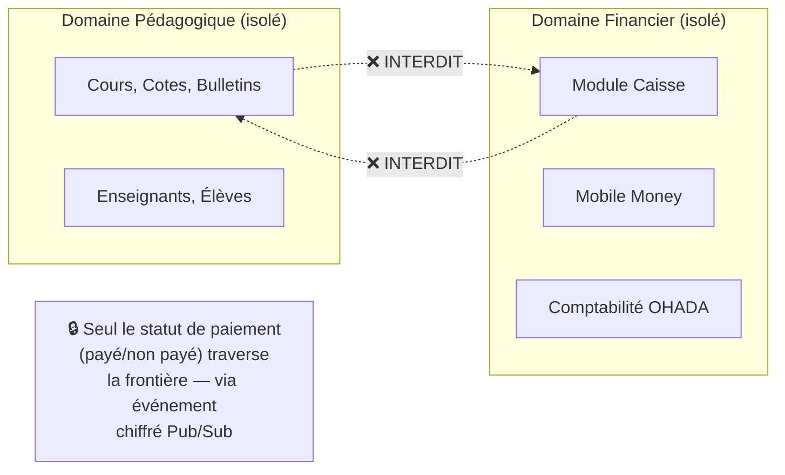
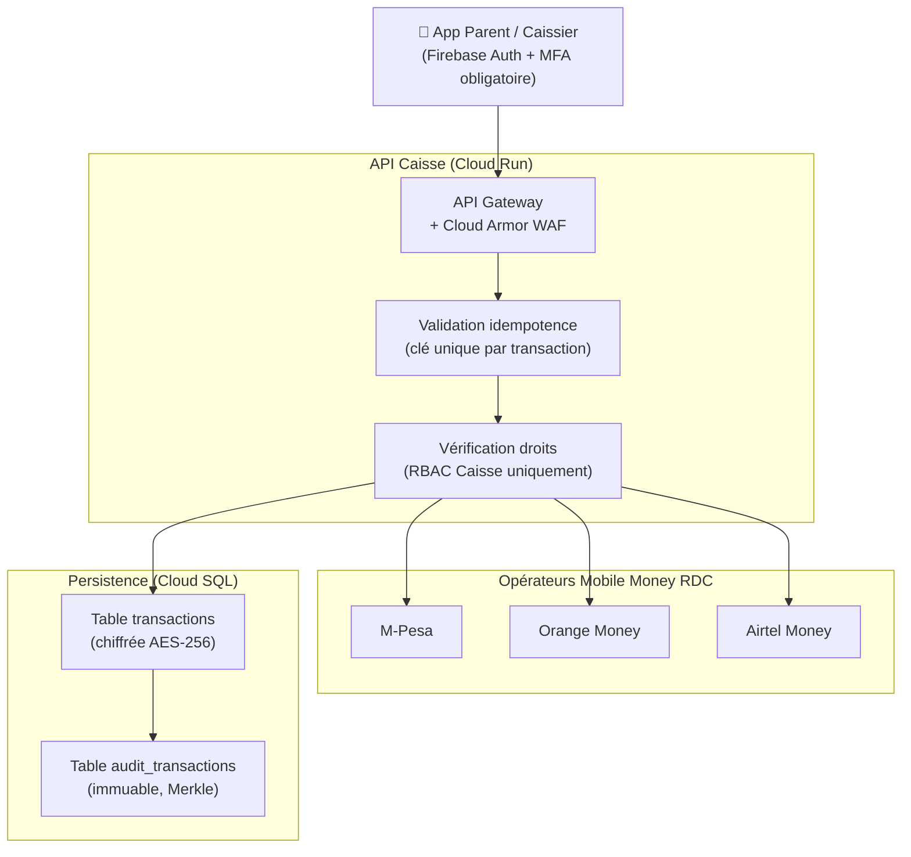

# Module 166 — Sécurité du Module Caisse et des Données Financières

> **Positionnement :** Tome 9 — Gouvernance des Données & Cybersécurité · Module 166 sur 170
> **Autorité :** RSSI ELLYSIUM / Responsable Financier / Conformité OHADA
> **Liaison amont/aval :** ← Module 165 (Sécurité mobile) · Module 122 (Mobile Money) · Module 123 (OHADA) → Module 167 →

---

## 1. Objet

Ce module définit les exigences de sécurité spécifiques au module de caisse d'ELLYSIUM : collecte des minervals, paiements Mobile Money (M-Pesa, Orange Money, Airtel Money), génération des reçus, rapprochement comptable et protection des données financières. La Constitution (Art. 5) impose une **étanchéité absolue** entre le domaine pédagogique et le domaine financier.

---

## 2. Périmètre et Étanchéité Financière (Art. 5)



**Le seul signal qui traverse la frontière :** un événement Cloud Pub/Sub chiffré indiquant `STATUT_MINERVAL = PAYÉ`, sans aucune donnée financière détaillée.

---

## 3. Architecture de Sécurité du Module Caisse



---

## 4. Idempotence des Transactions

**Règle absolue** : Toute transaction financière doit être idempotente. Un paiement ne peut pas être enregistré deux fois même si la requête arrive plusieurs fois (réseau instable RDC).

```go
// Clé d'idempotence : hash SHA-256(eleveID + montant + operateur + timestamp_minute)
// Stockée dans Cloud Memorystore (Redis) avec TTL 24h

func (s *CaisseService) EncaisserMinerval(ctx context.Context, req *EncaissementRequest) (*Recu, error) {
    idempotencyKey := sha256.Sum256([]byte(
        req.EleveID + req.Montant + req.Operateur + req.TimestampMinute,
    ))

    // Vérifier si la transaction existe déjà
    existing, err := s.redis.Get(ctx, hex.EncodeToString(idempotencyKey[:]))
    if err == nil {
        // Transaction déjà traitée → retourner le reçu existant
        return s.getRecuExistant(ctx, existing)
    }

    // Nouvelle transaction → procéder
    recu, err := s.traiterPaiement(ctx, req)
    if err != nil {
        return nil, err
    }

    // Marquer comme traitée (TTL 24h)
    s.redis.Set(ctx, hex.EncodeToString(idempotencyKey[:]), recu.ID, 24*time.Hour)
    return recu, nil
}
```

---

## 5. Sécurité des Données Financières

### 5.1 Chiffrement des données financières

```sql
-- Colonne montant chiffrée (AES-256-GCM via pgcrypto + Cloud KMS)
CREATE TABLE transactions (
    id              UUID PRIMARY KEY DEFAULT gen_random_uuid(),
    eleve_id        UUID NOT NULL,
    montant_cdf     BIGINT NOT NULL,  -- En centimes pour éviter les décimales
    montant_usd     BIGINT,           -- Optionnel (bimonétaire)
    operateur       TEXT NOT NULL CHECK (operateur IN ('MPESA','ORANGE','AIRTEL','ESPECES')),
    reference_mm    TEXT,             -- Référence opérateur (chiffrée)
    statut          TEXT NOT NULL CHECK (statut IN ('EN_ATTENTE','CONFIRME','ECHOUE','REMBOURSE')),
    hash_recu       TEXT NOT NULL,    -- SHA-256 du reçu généré
    merkle_hash     TEXT NOT NULL,    -- Chaîne d'intégrité
    created_at      TIMESTAMPTZ DEFAULT NOW(),
    confirmed_at    TIMESTAMPTZ,
    caissier_id     UUID NOT NULL,    -- Qui a enregistré
    etablissement_id UUID NOT NULL,
    annee_academique TEXT NOT NULL
);

-- RLS : isolation par établissement
ALTER TABLE transactions ENABLE ROW LEVEL SECURITY;
CREATE POLICY tx_isolation ON transactions
    FOR ALL TO role_caisse
    USING (etablissement_id = current_setting('app.current_etablissement_id')::UUID);
```

### 5.2 Accès aux données financières (RBAC strict)

| Fonctionnalité | Caissier | Directeur | Comptable | Préfet | Enseignant | Élève | Parent |
|---|:---:|:---:|:---:|:---:|:---:|:---:|:---:|
| Encaisser un paiement | ✅ | ✅ | ❌ | ❌ | ❌ | ❌ | ❌ |
| Voir toutes les transactions | ❌ | ✅ | ✅ | ❌ | ❌ | ❌ | ❌ |
| Voir ses propres paiements | ❌ | ❌ | ❌ | ❌ | ❌ | ✅ | ✅ |
| Émettre un remboursement | ❌ | ✅ | ❌ | ❌ | ❌ | ❌ | ❌ |
| Rapport comptable OHADA | ❌ | ✅ | ✅ | ❌ | ❌ | ❌ | ❌ |
| Exporter FEC | ❌ | ✅ | ✅ | ❌ | ❌ | ❌ | ❌ |

---

## 6. Sécurité des Reçus Numériques

```
Chaque reçu généré contient :
  - Numéro de reçu séquentiel unique (non devinable)
  - QR code dynamique Firebase Dynamic Link → vérification en ligne
  - Hash SHA-256 du contenu du reçu (détection falsification)
  - Signature numérique de l'établissement (Cloud KMS)
  - Horodatage RFC 3339 avec fuseau UTC+2 (Kinshasa)

Les reçus sont conservés 10 ans (obligations OHADA).
Les reçus sont chiffrés dans Cloud Storage (GCS) bucket privé.
```

---

## 7. Détection des Fraudes Financières

```python
# Cloud Functions — Détection anomalies financières
REGLES_FRAUDE = [
    # Même élève payé deux fois dans la même journée
    "SELECT eleve_id FROM transactions WHERE statut='CONFIRME' AND DATE(created_at) = TODAY GROUP BY eleve_id HAVING COUNT(*) > 1",

    # Montant hors plage normale (> 3σ de la moyenne)
    "SELECT * FROM transactions WHERE montant_cdf > mean + 3*stddev",

    # Caissier créant > 50 transactions/heure
    "SELECT caissier_id, COUNT(*) FROM transactions WHERE created_at > NOW()-1H GROUP BY caissier_id HAVING COUNT(*) > 50",

    # Transaction à heure inhabituelle (après 22h ou avant 6h)
    "SELECT * FROM transactions WHERE EXTRACT(HOUR FROM created_at) > 22 OR EXTRACT(HOUR FROM created_at) < 6",
]
# Alerte via Cloud Monitoring → RSSI + Directeur
```

---

## 8. Conformité PCI-DSS (Niveau 4)

```
ELLYSIUM ne stocke jamais :
  ❌ Numéros de cartes bancaires (PAN)
  ❌ CVV / CVC
  ❌ PINs Mobile Money
  ❌ Codes d'authentification des opérateurs

ELLYSIUM stocke uniquement :
  ✅ Références de transaction opérateur (ex: "MPESA-REF-001234")
  ✅ Statut de la transaction (CONFIRMÉ / ÉCHOUÉ)
  ✅ Montant et devise
  ✅ Identifiant de l'élève/payeur (IUNE)
```

---

## 9. Verrous Fonctionnels

| ID | Règle | Niveau |
|---|---|---|
| VF-166-01 | Les enseignants et le personnel pédagogique n'ont AUCUN accès aux données financières | CONSTITUTIONNEL |
| VF-166-02 | Toute transaction est idempotente : impossible d'encaisser deux fois le même minerval | OBLIGATOIRE |
| VF-166-03 | Aucun numéro de carte, PIN ou secret Mobile Money n'est jamais stocké | LÉGAL (PCI-DSS) |
| VF-166-04 | Les reçus sont signés cryptographiquement et conservés 10 ans (OHADA) | LÉGAL |
| VF-166-05 | Toute anomalie financière déclenche une alerte immédiate au RSSI et au Directeur | OBLIGATOIRE |
| VF-166-06 | L'accès au module caisse requiert MFA obligatoire, quelle que soit l'heure | OBLIGATOIRE |

---

*Sous-tome rédigé conformément aux Normes documentaires ELLYSIUM — Fondations 04.*
