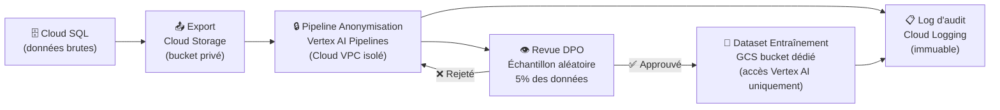

# Module 167 — Anonymisation des Données pour l'Entraînement IA

> **Positionnement :** Tome 9 — Gouvernance des Données & Cybersécurité · Module 167 sur 170
> **Autorité :** DPO Souverain ELLYSIUM / Responsable IA Éthique (Tome 8)
> **Liaison amont/aval :** ← Module 166 (Caisse) · Module 131 (Gouvernance IA) · Module 147 (Fine-tuning) → Module 168 →

---

## 1. Objet

Ce module définit les procédures d'anonymisation et de pseudonymisation des données ELLYSIUM utilisées pour l'entraînement, le fine-tuning et l'évaluation des modèles d'intelligence artificielle. Il garantit que **jamais un identifiant personnel réel** ne transite vers les systèmes d'IA, conformément à l'Article 6 de la Constitution (Auxiliarité stricte de l'IA) et à la loi RDC n° 15/023.

---

## 2. Principe Fondamental

```
🛡️ RÈGLE CONSTITUTIONNELLE :
Les données personnelles identifiantes (nom, IUNE, établissement, adresse)
ne peuvent JAMAIS être transmises à un système d'IA, que ce soit pour
l'inférence, l'entraînement, l'évaluation ou tout autre usage.

Seules des données anonymisées irréversiblement ou pseudonymisées
avec clé séquestrée peuvent être utilisées.
```

---

## 3. Taxonomie des Données selon leur Usage IA

```mermaid
graph TB
    subgraph "Données INTERDITES pour l'IA"
        D1["Nom et prénom de l'élève"]
        D2["IUNE (identifiant unique)"]
        D3["Adresse, téléphone, email"]
        D4["Photo, biométrie"]
        D5["Données financières (montant, référence)"]
        D6["Données de santé"]
    end

    subgraph "Données PSEUDONYMISÉES (clé séquestrée)"
        P1["ID élève hachée (HMAC-SHA256 + sel rotatif)"]
        P2["Tranche d'âge (pas l'âge exact)"]
        P3["Province (pas la ville)"]
        P4["Niveau scolaire (pas l'établissement)"]
    end

    subgraph "Données AUTORISÉES (anonymes agrégées)"
        A1["Réponses aux exercices (sans auteur)"]
        A2["Durée de résolution d'un problème"]
        A3["Taux de réussite par type de question"]
        A4["Séquence pédagogique (anonymisée)"]
        A5["Transcriptions corrigées (sans nom)"]
    end

    D1 & D2 & D3 & D4 & D5 & D6 -->|❌ BLOQUÉ| IA_SYSTEMS["Systèmes IA (Vertex AI)"]
    P1 & P2 & P3 & P4 -->|✅ Autorisé (avec protocole)| IA_SYSTEMS
    A1 & A2 & A3 & A4 & A5 -->|✅ Autorisé directement| IA_SYSTEMS
```

---

## 4. Techniques d'Anonymisation Appliquées

### 4.1 Suppression / Masquage

```python
# Suppression des champs identifiants avant export vers Vertex AI
def anonymiser_session_apprentissage(session: dict) -> dict:
    CHAMPS_A_SUPPRIMER = [
        'nom', 'prenom', 'iune', 'email', 'telephone',
        'adresse', 'etablissement_nom', 'photo_url',
        'id_parent', 'ip_address', 'device_id'
    ]
    return {k: v for k, v in session.items() if k not in CHAMPS_A_SUPPRIMER}
```

### 4.2 Pseudonymisation (HMAC-SHA256 + sel rotatif)

```python
import hmac
import hashlib

# Le sel est rotatif (changé tous les 3 mois) et stocké dans Cloud KMS
# La correspondance IUNE ↔ pseudo_id est SEQUESTRÉE (DPO uniquement)

def pseudonymiser(iune: str, sel_kms: bytes) -> str:
    """
    Crée un identifiant pseudonyme irréversible sans le sel.
    Permet de lier les sessions d'un même élève sans révéler son identité.
    """
    return hmac.new(sel_kms, iune.encode(), hashlib.sha256).hexdigest()[:16]

# Exemple :
# IUNE "CD-EL-2025-01428590" → pseudo "a3f8c2d1e9b07456" (non réversible sans sel)
```

### 4.3 Généralisation

```python
# Remplacement de valeurs précises par des intervalles
def generaliser_age(age_exact: int) -> str:
    if age_exact < 12: return "moins_de_12"
    if age_exact < 15: return "12_14"
    if age_exact < 18: return "15_17"
    if age_exact < 22: return "18_21"
    return "22_et_plus"

def generaliser_localisation(ville: str) -> str:
    PROVINCES = {
        'Kinshasa': 'Kinshasa', 'Lubumbashi': 'Haut-Katanga',
        'Goma': 'Nord-Kivu', 'Bukavu': 'Sud-Kivu',
        # ... mapping ville → province uniquement
    }
    return PROVINCES.get(ville, 'Autre')
```

### 4.4 Bruit Différentiel (Differential Privacy)

```python
# Pour les statistiques agrégées partagées avec des partenaires
# ε = 1.0 (niveau de privacy fort)

import tensorflow_privacy as tfp

dp_query = tfp.QuantileAdaptiveClipSumQuery(
    initial_l2_norm_clip=1.0,
    noise_multiplier=1.1,
    target_unclipped_quantile=0.9,
    learning_rate=0.01,
    clipped_count_stddev=0.0,
    expected_num_records=1000,
    geometric_update=True,
)
```

---

## 5. Pipeline d'Anonymisation (Vertex AI Pipelines)



---

## 6. Gouvernance du Dataset d'Entraînement

| Règle | Détail |
|---|---|
| **Approbation DPO** | Tout nouveau dataset doit être approuvé par le DPO avant usage |
| **Registre des datasets** | Chaque dataset est enregistré (origine, date, méthode d'anonymisation, approuvé par) |
| **Test de ré-identification** | Un test automatique vérifie que la ré-identification est impossible (k-anonymat ≥ 5) |
| **Suppression sur demande** | Si un élève demande la suppression de ses données, le dataset est reprocessé |
| **Rétention limitée** | Les datasets d'entraînement sont conservés 2 ans maximum |
| **Accès restreint** | Seul le rôle `vertex-ai-trainer` (compte de service) peut lire le bucket d'entraînement |

---

## 7. K-Anonymat et L-Diversité

```python
# Vérification que chaque combinaison d'attributs quasi-identifiants
# apparaît au moins k=5 fois dans le dataset (k-anonymat)

def verifier_k_anonymat(df: pd.DataFrame, quasi_identifiants: list, k: int = 5) -> bool:
    groupes = df.groupby(quasi_identifiants).size()
    violations = groupes[groupes < k]
    if len(violations) > 0:
        logger.warning(f"K-anonymat violé pour {len(violations)} groupes")
        return False
    return True

# Quasi-identifiants ELLYSIUM : [tranche_age, province, niveau_scolaire, sexe]
ok = verifier_k_anonymat(dataset, ['tranche_age', 'province', 'niveau', 'sexe'], k=5)
```

---

## 8. Verrous Fonctionnels

| ID | Règle | Niveau |
|---|---|---|
| VF-167-01 | Aucune donnée identifiante (nom, IUNE, email) ne peut être transmise à un système IA | CONSTITUTIONNEL |
| VF-167-02 | Tout dataset d'entraînement doit passer la vérification k-anonymat (k ≥ 5) | OBLIGATOIRE |
| VF-167-03 | Le sel de pseudonymisation est stocké dans Cloud KMS, jamais dans le code | OBLIGATOIRE |
| VF-167-04 | La revue DPO est obligatoire avant tout nouvel usage d'un dataset | OBLIGATOIRE |
| VF-167-05 | Les données des mineurs sont soumises à des règles d'anonymisation renforcées (k ≥ 10) | LÉGAL |
| VF-167-06 | Un registre immuable de tous les datasets d'entraînement est tenu par le DPO | OBLIGATOIRE |

---

*Sous-tome rédigé conformément aux Normes documentaires ELLYSIUM — Fondations 04.*
