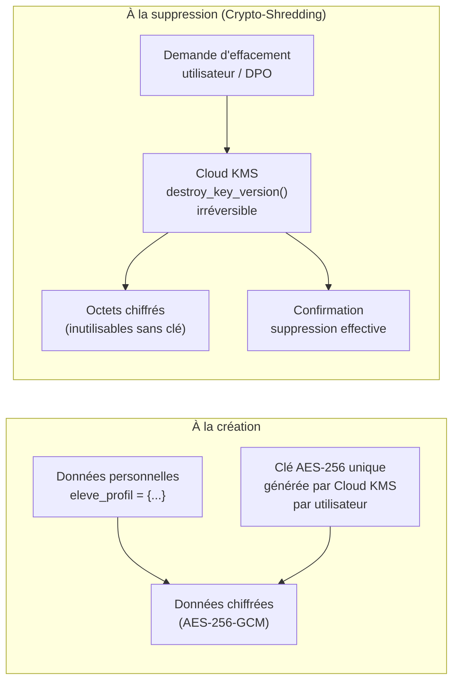
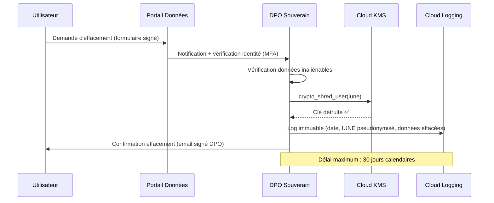

# Module 168 — Politique de Rétention et de Suppression sur Demande

> **Positionnement :** Tome 9 — Gouvernance des Données & Cybersécurité · Module 168 sur 170
> **Autorité :** DPO Souverain ELLYSIUM
> **Liaison amont/aval :** ← Module 167 (Anonymisation IA) · Module 154 (Cycle de vie) → Module 169 (Conformité) →

---

## 1. Objet

Ce module définit les durées de rétention pour chaque catégorie de données d'ELLYSIUM et les procédures de suppression sécurisée (Crypto-Shredding) en réponse aux demandes d'effacement des utilisateurs. Il articule le droit à l'oubli avec les obligations légales de conservation (diplômes, comptabilité OHADA, archives nationales).

---

## 2. Tableau de Rétention par Catégorie

| Catégorie de données | Durée de rétention | Justification légale | Méthode de suppression |
|---|---|---|---|
| **Diplômes, certificats, bulletins scellés** | **50 ans** | Archives nationales RDC, Art. 12 Constitution | Jamais supprimés (inaliénables) |
| **Données de paiement (OHADA)** | **10 ans** | SYSCOHADA, obligations comptables | Crypto-Shredding |
| **Données pédagogiques (cours, TJ, TFE)** | **10 ans après fin scolarité** | Recours académique possible | Crypto-Shredding |
| **Logs d'audit de sécurité** | **7 ans** | Exigences légales cybersécurité | Suppression sécurisée GCS |
| **Données d'authentification (connexions)** | **3 ans** | Traçabilité et investigations | Suppression Cloud Logging |
| **Messages / forums** | **5 ans ou demande utilisateur** | Modération, responsabilité | Anonymisation puis purge |
| **Données de profil (coordonnées)** | **Durée de relation + 1 an** | Loi RDC 15/023 | Crypto-Shredding |
| **Données analytics anonymisées** | **5 ans** | Amélioration service | Suppression GCS |
| **Données d'entraînement IA** | **2 ans** | Politique IA éthique Module 167 | Suppression sécurisée |
| **Snapshots de backup** | **Selon tableau Module 161** | Plan de reprise | Suppression automatique |
| **Tokens / sessions expirés** | **90 jours** | Forensics potentiel | Purge automatique Redis |

---

## 3. Crypto-Shredding — Suppression Souveraine

La suppression définitive dans ELLYSIUM est réalisée par **Crypto-Shredding** : destruction de la clé de chiffrement, rendant les données inaccessibles de manière irréversible, même si les octets chiffrés subsistent physiquement.



### Implémentation Cloud KMS

```python
# Suppression de la clé → données inaccessibles définitivement
from google.cloud import kms

def crypto_shred_user(iune: str) -> bool:
    client = kms.KeyManagementServiceClient()

    # Construire le nom de la version de clé
    key_version_name = client.crypto_key_version_path(
        project='ellysium-prod',
        location='africa-south1',
        key_ring='ellysium-user-keys',
        crypto_key=f'user-{iune}',
        crypto_key_version='1'
    )

    # Destruction irréversible de la clé (délai GCP : 24h, configurable à 0 pour urgences)
    client.destroy_crypto_key_version(name=key_version_name)

    # Log d'audit immuable
    logger.info(f"CRYPTO_SHRED: IUNE={iune} clé détruite — {datetime.utcnow().isoformat()}")
    return True
```

---

## 4. Droit à l'Oubli — Procédure de Demande d'Effacement

### 4.1 Qui peut demander l'effacement ?

| Demandeur | Données concernées | Délai de traitement |
|---|---|---|
| Apprenant indépendant (AIS/AIU) | Toutes ses données sauf diplômes | 30 jours |
| Élève affilié (ou parent si mineur) | Profil, parcours (sauf bulletins scellés) | 30 jours |
| Enseignant | Profil, données de session | 30 jours |
| Parent | Données de paiement (après 10 ans) | 30 jours |
| DPO (d'office) | Données expirées, données compromises | Immédiat |

### 4.2 Ce qui NE PEUT PAS être supprimé (inaliénable)

```
❌ Bulletins scolaires scellés par le Préfet
❌ Diplômes émis (EXETAT, Licence, Master, Doctorat)
❌ PV de délibération des jurys
❌ Logs d'audit de sécurité (7 ans minimum)
❌ Données comptables (10 ans — OHADA)
❌ Données nécessaires à des litiges en cours
```

### 4.3 Flux de traitement d'une demande



---

## 5. Purge Automatique (Lifecycle Management)

### 5.1 Cloud SQL — Purge périodique

```sql
-- Cloud Functions CRON (Cloud Scheduler) — Exécution mensuelle
-- Purge des tokens expirés
DELETE FROM refresh_tokens WHERE expires_at < NOW() - INTERVAL '90 days';

-- Pseudonymisation des messages anciens (> 5 ans)
UPDATE forum_messages
SET
    auteur_iune = pseudonymiser_permanent(auteur_iune),
    auteur_nom = 'Utilisateur supprimé'
WHERE created_at < NOW() - INTERVAL '5 years'
  AND NOT anonymise;

-- Purge des sessions d'analytics expirées
DELETE FROM analytics_sessions WHERE session_date < NOW() - INTERVAL '5 years';
```

### 5.2 Cloud Storage — Lifecycle Rules

```json
{
  "lifecycle": {
    "rule": [
      {
        "action": { "type": "Delete" },
        "condition": {
          "age": 730,
          "matchesPrefix": ["ai-training-datasets/"]
        }
      },
      {
        "action": { "type": "SetStorageClass", "storageClass": "COLDLINE" },
        "condition": {
          "age": 365,
          "matchesPrefix": ["audit-logs/"]
        }
      },
      {
        "action": { "type": "SetStorageClass", "storageClass": "ARCHIVE" },
        "condition": {
          "age": 1825,
          "matchesPrefix": ["audit-logs/"]
        }
      }
    ]
  }
}
```

---

## 6. Registre des Suppressions (DPO)

```sql
CREATE TABLE registre_suppressions (
    id              UUID PRIMARY KEY DEFAULT gen_random_uuid(),
    date_demande    TIMESTAMPTZ NOT NULL,
    date_execution  TIMESTAMPTZ NOT NULL,
    iune_pseudonyme TEXT NOT NULL,  -- Jamais l'IUNE réel !
    type_demande    TEXT NOT NULL CHECK (type_demande IN ('EFFACEMENT','PORTABILITE','RECTIFICATION')),
    categories_supprimees TEXT[],
    categories_conservees TEXT[],  -- Avec justification
    methode         TEXT NOT NULL CHECK (methode IN ('CRYPTO_SHREDDING','ANONYMISATION','PURGE_DB')),
    confirme_par    UUID NOT NULL,  -- DPO
    created_at      TIMESTAMPTZ DEFAULT NOW()
);
```

---

## 7. Verrous Fonctionnels

| ID | Règle | Niveau |
|---|---|---|
| VF-168-01 | Les diplômes, bulletins scellés et PV de jury sont conservés 50 ans et ne peuvent être supprimés | CONSTITUTIONNEL |
| VF-168-02 | La suppression effective se fait par Crypto-Shredding (destruction de la clé KMS) | OBLIGATOIRE |
| VF-168-03 | Toute demande d'effacement est traitée en < 30 jours calendaires | LÉGAL |
| VF-168-04 | La purge automatique mensuelle supprime les données expirées sans intervention humaine | OBLIGATOIRE |
| VF-168-05 | Le registre des suppressions est tenu par le DPO et conservé 5 ans | OBLIGATOIRE |
| VF-168-06 | L'IUNE réel n'apparaît jamais dans le registre des suppressions | OBLIGATOIRE |

---

*Sous-tome rédigé conformément aux Normes documentaires ELLYSIUM — Fondations 04.*
