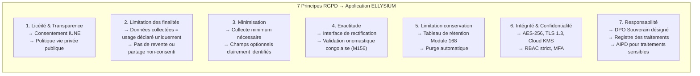

# Module 169 — Conformité aux Lois RDC (n° 15/023) et Standards Internationaux

> **Positionnement :** Tome 9 — Gouvernance des Données & Cybersécurité · Module 169 sur 170
> **Autorité :** DPO Souverain ELLYSIUM / Conseiller Juridique
> **Liaison amont/aval :** ← Module 168 (Rétention) · Module 151 (Conformité constitutionnelle) → Module 170 (Matrice) →

---

## 1. Objet

Ce module synthétise le cadre juridique complet applicable à ELLYSIUM en matière de protection des données, de cybersécurité et de conformité réglementaire. Il établit la correspondance entre les obligations légales congolaises et internationales et les mesures techniques concrètes mises en œuvre dans la plateforme.

---

## 2. Cadre Légal Congolais — Loi n° 15/023

### 2.1 Présentation de la loi

La **Loi n° 15/023 du 31 décembre 2015 modifiant et complétant la loi n° 013/2002 du 16 octobre 2002 sur les télécommunications** constitue le principal texte de référence en matière de protection des données et de cybersécurité en RDC.

> **Note** : La RDC travaille également sur une loi spécifique de protection des données personnelles. ELLYSIUM s'y conformera dès son adoption, ayant anticipé les exigences RGPD-compatibles.

### 2.2 Obligations légales RDC et mesures ELLYSIUM

| Obligation légale RDC | Texte de référence | Mesure ELLYSIUM |
|---|---|---|
| Consentement éclairé pour collecte données | Art. 15/023 | Formulaire de consentement IUNE, OTP parental mineurs |
| Sécurité des systèmes d'information | Décret 09/15 | TLS 1.3, AES-256, Cloud Armor, MFA (Module 158, 160) |
| Localisation des données souveraines | Ordonnance-loi | Région GCP africa-south1 + europe-west1 uniquement |
| Notification des violations | Pratiques ARPTC | Notification < 72h (Module 163) |
| Droit d'accès aux données personnelles | Art. 15/023 | Portail "Mes données" + export JSON |
| Droit de rectification | Art. 15/023 | Interface de modification profil + journalisation |
| Archivage obligatoire diplômes | MEPST/MINESU | Conservation 50 ans, Object Lock GCS |
| Lutte contre la cybercriminalité | Loi 09/001 | Cloud Armor, WAF, SIEM, réponse incidents |

---

## 3. Principes RGPD Appliqués (Standards Internationaux)

Bien que la RDC ne soit pas membre de l'UE, ELLYSIUM applique volontairement les principes RGPD comme standard de référence international, garantissant ainsi la confiance des partenaires et bailleurs internationaux.



---

## 4. Registre des Traitements (AIPD)

Conformément aux bonnes pratiques RGPD, ELLYSIUM tient un **Registre des Activités de Traitement** :

| Traitement | Finalité | Base légale | Catégories données | Destinataires | Rétention |
|---|---|---|---|---|---|
| Gestion des comptes | Accès à la plateforme | Contrat | Identité, contact, IUNE | ELLYSIUM uniquement | Durée relation + 1 an |
| Suivi pédagogique | Évaluation et progression | Intérêt légitime | Cotes, présences, TJ | Établissement + MEPST | 10 ans |
| Paiements minerval | Facturation | Contrat | Montants, références MM | ELLYSIUM + opérateurs | 10 ans (OHADA) |
| Émission diplômes | Certification officielle | Obligation légale | Identité, résultats | MEPST, ESU, ELLYSIUM | 50 ans |
| Analyse IA | Amélioration pédagogique | Consentement | Données anonymisées | Vertex AI (GCP) | 2 ans |
| Sécurité | Prévention fraude | Intérêt légitime | Logs connexion, IP | RSSI, ELLYSIUM | 3 ans |
| Support utilisateur | Assistance | Contrat | Données du ticket | Équipe support | 2 ans |

---

## 5. Analyse d'Impact sur la Protection des Données (AIPD)

Une AIPD est obligatoire pour les traitements suivants :

| Traitement à risque | AIPD requise | Statut |
|---|---|---|
| Données de mineurs (< 18 ans) | ✅ OUI | À réaliser avant lancement |
| Données biométriques (photo ID) | ✅ OUI | À réaliser avant lancement |
| Profilage IA des apprenants | ✅ OUI | À réaliser avant lancement |
| Surveillance / proctoring examens | ✅ OUI | À réaliser avant lancement |
| Données de santé / handicap | ✅ OUI | À réaliser si fonctionnalité activée |

---

## 6. Droits des Personnes Concernées

| Droit | Délai de réponse | Canal | Implémentation |
|---|---|---|---|
| Accès (art. 15 RGPD) | 30 jours | Portail "Mes données" | Export JSON complet |
| Rectification (art. 16) | 30 jours | Interface profil | Log modification |
| Effacement (art. 17) | 30 jours | Formulaire DPO | Crypto-Shredding (M168) |
| Limitation traitement (art. 18) | 30 jours | Formulaire DPO | Gel compte partiel |
| Portabilité (art. 20) | 30 jours | Portail "Mes données" | Export JSON/CSV standardisé |
| Opposition (art. 21) | 30 jours | Formulaire DPO | Opt-out analytics/IA |
| Opposition profilage (art. 22) | 30 jours | Formulaire DPO | Désactivation tuteur IA |

---

## 7. Conformité Sectorielle Éducation RDC

| Réglementation | Organisme | Mesures ELLYSIUM |
|---|---|---|
| Normes EPST (secondaire) | Ministère EPST | Terminologie officielle (EXETAT, TJ, cotes) |
| Normes ESU (supérieur) | Ministère ESU | Crédits ECTS, TFE, supplément diplôme |
| TENASOSP | Secrétariat d'État | Interface dédiée résultats nationaux |
| DIPROMAT | Ministère Éducation | Interconnexion registre diplômes |
| SECOPE | Ministère Éducation | Données enseignants (référentiel) |
| OHADA (comptabilité) | OHADA / SYSCOHADA | Module caisse conforme (Module 123) |

---

## 8. Contrats et Engagements Tiers

### 8.1 Google Cloud Platform (DPA)

```
ELLYSIUM signe avec Google Cloud le Data Processing Agreement (DPA) standard
qui garantit :
  ✅ Google traite les données uniquement sur instruction d'ELLYSIUM
  ✅ Sous-traitants Google approuvés et listés
  ✅ Transferts internationaux encadrés (SCCs)
  ✅ Coopération pour les droits des personnes
  ✅ Notification violation dans les 72h
```

### 8.2 Opérateurs Mobile Money

```
Chaque opérateur (M-Pesa, Orange, Airtel) signe avec ELLYSIUM :
  ✅ Accord de traitement en sous-traitance
  ✅ Engagement de sécurité PCI-DSS Level 4
  ✅ Non-réutilisation des données de transaction
  ✅ Délai de conservation limité côté opérateur
```

---

## 9. Verrous Fonctionnels

| ID | Règle | Niveau |
|---|---|---|
| VF-169-01 | ELLYSIUM est conforme à la loi RDC n° 15/023 et aux principes RGPD depuis son lancement | LÉGAL |
| VF-169-02 | Un DPO Souverain est désigné avant tout traitement de données personnelles | LÉGAL |
| VF-169-03 | Une AIPD est réalisée pour chaque traitement à risque élevé avant mise en production | LÉGAL |
| VF-169-04 | Le registre des traitements est tenu à jour et disponible pour les autorités RDC | LÉGAL |
| VF-169-05 | Les droits des personnes sont exercés dans les délais légaux (30 jours max) | LÉGAL |
| VF-169-06 | Le DPA Google Cloud est signé avant tout traitement de données en production | LÉGAL |

---

*Sous-tome rédigé conformément aux Normes documentaires ELLYSIUM — Fondations 04.*
