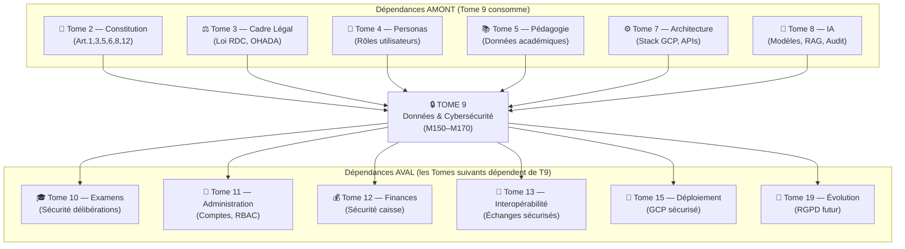
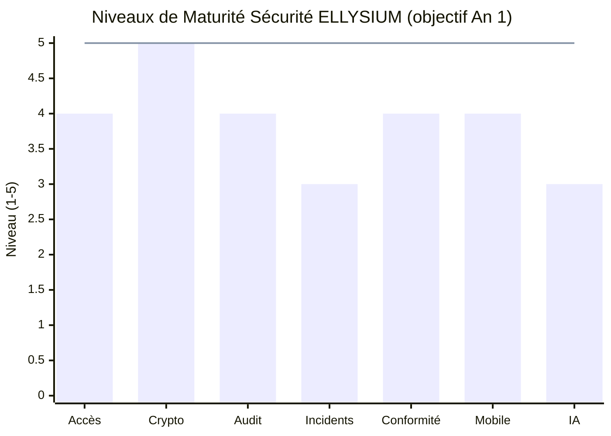

# Module 170 — Matrice des Dépendances — Tome 9 avec Tomes 7, 19, 5

> **Positionnement :** Tome 9 — Gouvernance des Données & Cybersécurité · Module 170 sur 170 (CLÔTURE)
> **Autorité :** Architecte Souverain ELLYSIUM / DPO / RSSI
> **Liaison amont/aval :** ← Module 169 (Conformité) · Clôture Tome 9 → Tome 10 (Examens) →

---

## 1. Objet

Ce module de clôture cartographie toutes les dépendances formelles entre le Tome 9 (Gouvernance des Données & Cybersécurité) et les autres tomes de l'architecture ELLYSIUM. Il garantit la cohérence systémique et identifie les points d'interface critiques entre la sécurité et le reste de la plateforme.

---

## 2. Vue d'Ensemble des Dépendances Tome 9



---

## 3. Matrice Détaillée des Dépendances

### 3.1 Dépendances AMONT (ce que Tome 9 reçoit)

| Module T9 | Dépend de | Module source | Interface |
|---|---|---|---|
| M151 (Conformité constitutionnelle) | Articles 1, 3, 5, 6, 8, 12 | **Tome 2** — Constitution | Textes juridiques |
| M152 (MCD/MPD) | Entités métier | **Tome 5** — Pédagogie | Schéma de données |
| M153 (Cartographie données) | Personas et rôles | **Tome 4** — Acteurs | Matrice personas × données |
| M158 (Chiffrement) | Stack GCP, Cloud KMS | **Tome 7** M109, M118 | Configuration infrastructure |
| M159 (RBAC/ABAC) | Rôles utilisateurs | **Tome 4** + **Tome 7** M117 | Matrice des rôles |
| M162 (Audit) | Cloud Logging, BigQuery | **Tome 7** M118, M128 | APIs GCP |
| M167 (Anonymisation IA) | Modèles, fine-tuning | **Tome 8** M131, M147 | Protocole anonymisation |
| M169 (Conformité) | Loi RDC 15/023 | **Tome 3** — Cadre légal | Textes légaux |

### 3.2 Dépendances AVAL (ce que Tome 9 fournit)

| Module T9 | Fournit à | Tome/Module cible | Ce qui est fourni |
|---|---|---|---|
| M152 (MCD) | Schéma DB complet | **Tome 7** M114 | Tables, index, contraintes |
| M158 (Chiffrement) | Politique TLS/AES | **Tome 7** M118 | Paramètres crypto |
| M159 (RBAC) | Matrice droits | **Tome 10** M180 (Délibérations) | Qui peut sceller |
| M159 (RBAC) | Matrice droits | **Tome 11** M194 (Comptes) | Cycle de vie comptes |
| M160 (MFA) | Règles auth | **Tome 7** M117 | Config Firebase Auth |
| M161 (Backups) | Stratégie 3-2-1 | **Tome 15** (Déploiement) | Plan DRP |
| M162 (Audit) | Logs immuables | **Tome 19** (Évolution) | Traçabilité long terme |
| M163 (Incidents) | Registre incidents | **Tome 19** (Évolution) | Base conformité future |
| M166 (Caisse) | Sécurité financière | **Tome 12** (Finances) | RBAC finances |
| M167 (Anonymisation) | Dataset IA | **Tome 8** M147 (Fine-tuning) | Données entraînement |
| M168 (Rétention) | Tableau conservation | **Tome 11** M193 (Comptes) | Durées légales |
| M169 (Conformité) | DPA, registres | **Tome 3** + **Tome 19** | Obligations légales |

---

## 4. Points d'Interface Critiques

### 4.1 Interface T9 ↔ T7 (Architecture Technique)

```
ELLYSIUM exige que l'infrastructure GCP (Tome 7) implémente :
  ← Cloud KMS (Tome 7, M118) alimenté par les exigences M158
  ← Cloud Logging WORM (Tome 7, M128) configuré selon M162
  ← Firebase Auth (Tome 7, M117) paramétré selon M159 et M160
  ← Cloud Armor WAF (Tome 7, M118) avec règles OWASP selon M164
  ← GCS Object Lock (Tome 7, M119) selon M161 et M168
```

### 4.2 Interface T9 ↔ T10 (Examens)

```
T10 reçoit de T9 :
  ← Procédure de scellement des délibérations (M159 — qui peut sceller)
  ← Hash SHA-256 des bulletins (M158 — algorithme de hachage)
  ← Logs d'audit des délibérations (M162 — journalisation)
  ← Signature numérique des diplômes (M158 — Cloud KMS)
```

### 4.3 Interface T9 ↔ T8 (Intelligence Artificielle)

```
T9 contraint T8 :
  ← Aucune donnée identifiante vers Vertex AI (M167)
  ← Logs d'audit IA chaînés (M146 T8 ↔ M162 T9)
  ← Rôle de service IA sans droits d'escalade (M159)
  ← Dataset anonymisé avec AIPD (M169 → M147)
```

---

## 5. Tableau de Synthèse — Couverture Sécurité du Tome 9

| Domaine de sécurité | Modules couvrants | Statut |
|---|---|---|
| Gouvernance & conformité | M150, M151, M169 | ✅ COMPLET |
| Modélisation des données | M152, M153 | ✅ COMPLET |
| Cycle de vie des données | M154, M168 | ✅ COMPLET |
| Intégrité & historisation | M155, M162 | ✅ COMPLET |
| Qualité & nettoyage | M156 | ✅ COMPLET |
| Protection des mineurs | M157 | ✅ COMPLET |
| Chiffrement (repos + transit) | M158 | ✅ COMPLET |
| Authentification & accès | M159, M160 | ✅ COMPLET |
| Sauvegardes & reprise | M161 | ✅ COMPLET |
| Audit & journalisation | M162 | ✅ COMPLET |
| Gestion des incidents | M163 | ✅ COMPLET |
| Protection OWASP Top 10 | M164 | ✅ COMPLET |
| Sécurité mobile & web | M165 | ✅ COMPLET |
| Sécurité financière | M166 | ✅ COMPLET |
| Anonymisation IA | M167 | ✅ COMPLET |
| Rétention & suppression | M168 | ✅ COMPLET |
| Conformité légale | M169 | ✅ COMPLET |

**→ Tome 9 : 21 modules sur 21 — COMPLET ✅**

---

## 6. Indicateurs de Maturité Sécurité (Cible An 1)



*Légende : Barres = niveau actuel documenté · Ligne = objectif An 3*

---

## 7. Prochaine Étape

Le Tome 9 étant **complet et clos**, le chantier ELLYSIUM continue avec :

> **→ TOME 10 — EXAMENS, CERTIFICATIONS, BULLETINS ET DIPLÔMES**
> *Modules 171 à 191 — Système d'évaluation de référence nationale RDC*

---

*Sous-tome rédigé conformément aux Normes documentaires ELLYSIUM — Fondations 04.*
*Tome 9 — GOUVERNANCE DES DONNÉES & CYBERSÉCURITÉ — COMPLET ✅*
*21 modules rédigés : M150 → M170*
