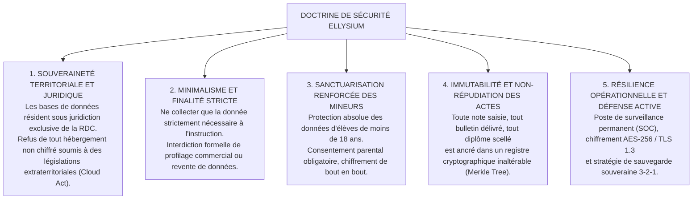

# TOME 9 — GOUVERNANCE DES DONNÉES, CYBERSÉCURITÉ ET SOUVERAINETÉ NUMÉRIQUE

---

> **Autorité doctrinale :** Conforme à la Constitution ELLYSIUM (Tome 2, Art. 1 — Souveraineté, Art. 3 — Protection des mineurs, Art. 8 — Traçabilité et droit de recours) et au Code du Numérique congolais (Ordonnance-Loi n° 23/010 du 13 mars 2023)  
> **Liaison amont :** Tome 5 (Architecture Fonctionnelle), Tome 7 (Architecture Technique), Tome 8 (Intelligence Artificielle)  
> **Liaison aval :** Tome 10 (Examens & Diplômes), Tome 14 (Cadre Juridique), Tome 19 (Sécurité Globale)

---

## 1. Vision et Principes Directeurs de Sécurité

Les données éducatives, académiques et biométriques des enfants et des citoyens congolais constituent un patrimoine stratégique d'État. Leur captation, leur fuite ou leur falsification par des puissances étrangères, des groupes criminels ou des réseaux de fraude scolaire porterait une atteinte directe à la souveraineté nationale. Le Tome 9 définit la doctrine de **Sanctuarisation Souveraine des Données**, articulée autour de 5 principes cardinaux :

---

## 2. Sommaire des 21 Sous-Tomes de Données et Sécurité

| Sous-Tome | Intitulé | Objet & Contenu Clé |
|---|---|---|
| [**150**](./150/README.md) | **Périmètre du Tome 9 — Principes de Gouvernance** | Cadre global de protection des données, rôles DPO souverain |
| [**151**](./151/README.md) | **Conformité Constitutionnelle et Légale** | Alignement sur l'Ordonnance-Loi n° 23/010 (Code du Numérique RDC) |
| [**152**](./152/README.md) | **Modèle de Données Conceptuel et Physique** | Schéma entités-relations relationnel sécurisé et indexation |
| [**153**](./153/README.md) | **Cartographie des Données par Acteur** | Matrice des données collectées pour les 12 personas |
| [**154**](./154/README.md) | **Cycle de Vie de la Donnée** | De la collecte à l'archivage historique ou purge |
| [**155**](./155/README.md) | **Historisation et Versionnement Inaltérable** | Append-only event store, audit trail horodaté |
| [**156**](./156/README.md) | **Qualité, Nettoyage et Dédoublonnage** | Détection des faux IUNE, normalisation des patronymes |
| [**157**](./157/README.md) | **Protection Renforcée des Données des Mineurs** | Consentement parental, isolation des communications |
| [**158**](./158/README.md) | **Chiffrement au Repos et en Transit** | TLS 1.3, AES-256-GCM, gestion des clés par HSM d'État |
| [**159**](./159/README.md) | **Gestion des Accès et Contrôle RBAC/ABAC** | Permissions granulaires, ségrégation des fonctions (SoD) |
| [**160**](./160/README.md) | **Politique de Mots de Passe et MFA** | Hachage Argon2id, double authentification TOTP et SMS d'État |
| [**161**](./161/README.md) | **Sauvegardes et Reprise (Stratégie 3-2-1)** | Sauvegardes immuables hors-site, tests de restauration réguliers |
| [**162**](./162/README.md) | **Audit de Sécurité, Logs et Pentests** | Journalisation SIEM, audits de code SAST/DAST, bug bounty civique |
| [**163**](./163/README.md) | **Gestion des Incidents et Violations de Données** | Procédure d'alerte CSIRT, notification légale sous 48 heures |
| [**164**](./164/README.md) | **Défense contre les Cyberattaques (OWASP Top 10)** | Remparts anti-injections SQL, XSS, CSRF, DDoS WAF |
| [**165**](./165/README.md) | **Sécurité des Clients Web et Mobiles** | Obfuscation APK, protection contre le reverse-engineering |
| [**166**](./166/README.md) | **Sécurité de la Caisse et Transactions Financières** | Cloisonnement bancaire, détection des fraudes Mobile Money |
| [**167**](./167/README.md) | **Anonymisation pour l'Entraînement de l'IA** | Confidentialité différentielle (Differential Privacy) et k-anonymat |
| [**168**](./168/README.md) | **Politique de Rétention et Purge Légale** | Délais de conservation opposables et droit à l'oubli encadré |
| [**169**](./169/README.md) | **Conformité Juridique RDC et Standards Internationaux** | Loi-cadre 14/004, Code du Numérique RDC, RGPD équivalent |
| [**170**](./170/README.md) | **Matrice des Dépendances Formelle** | Liaisons contractuelles du Tome 9 avec les Tomes 7, 19 et 5 |

---

*Tome 9 approuvé conformément aux principes directeurs du Plan Général d'Implémentation (PGI).*  
*Référence : ELLYSIUM/T9/README/v1.0*
